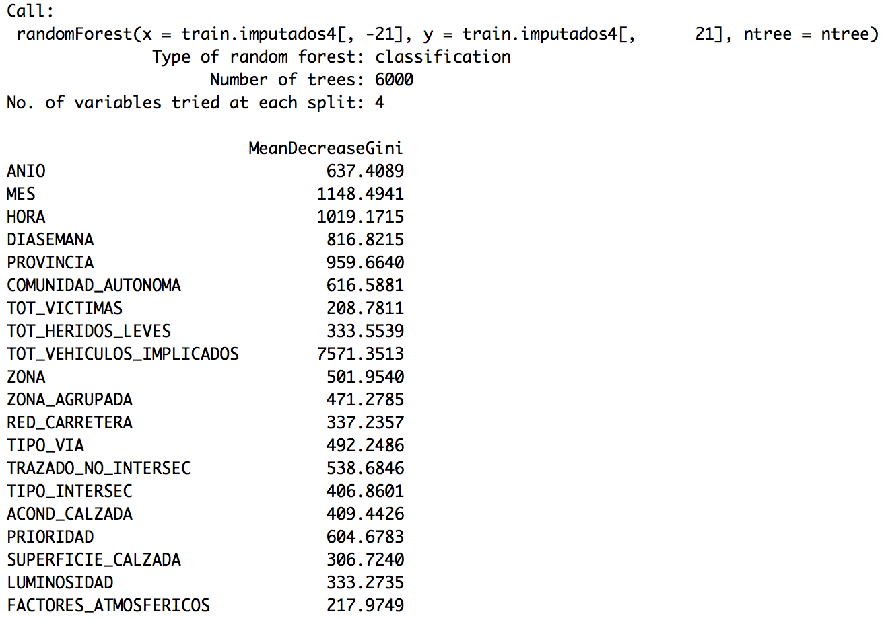
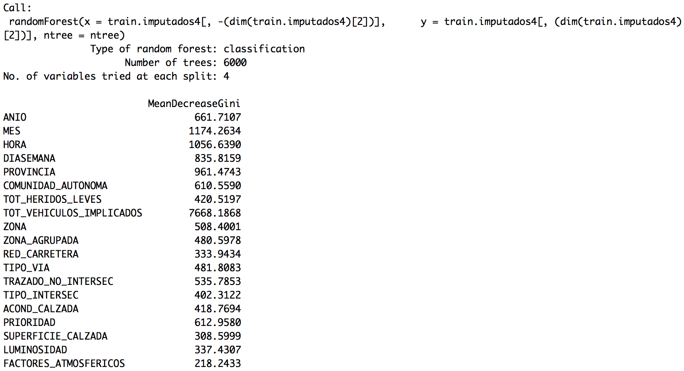
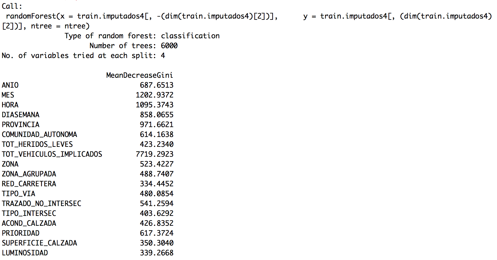
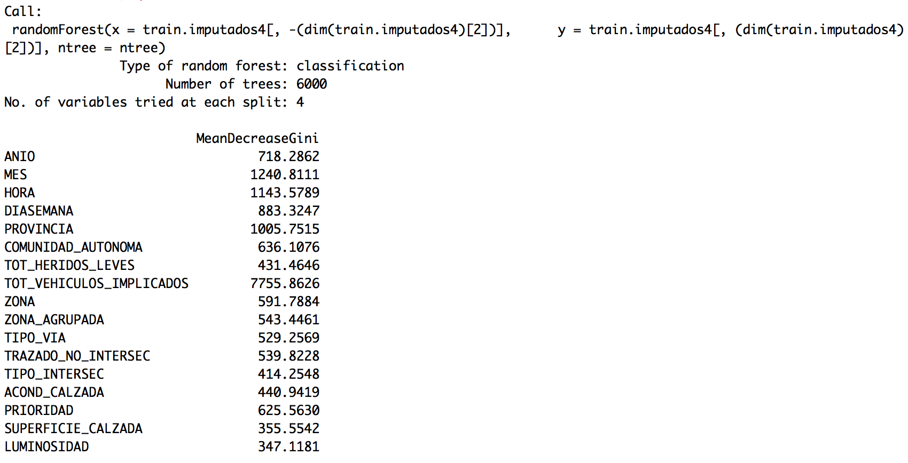
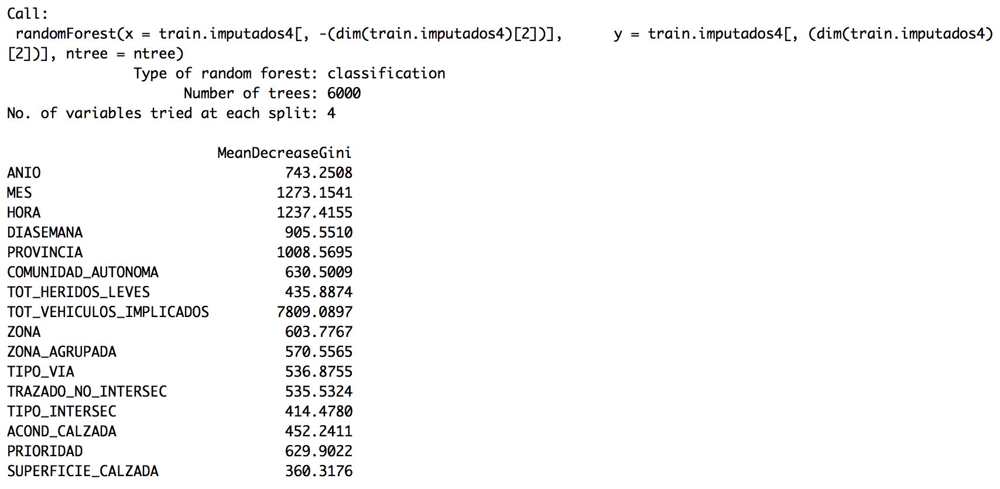
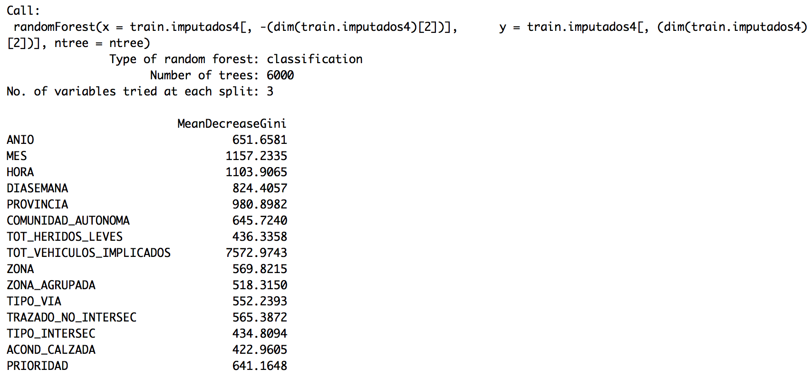
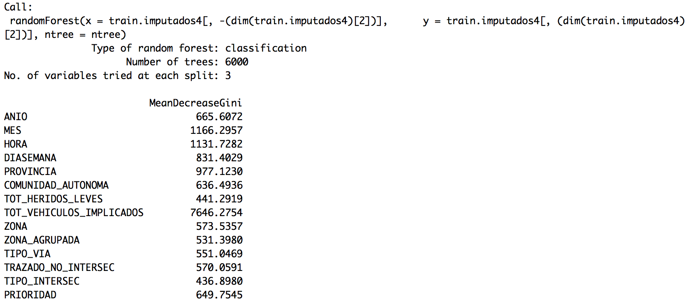
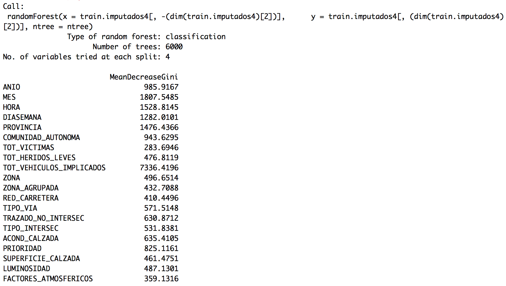
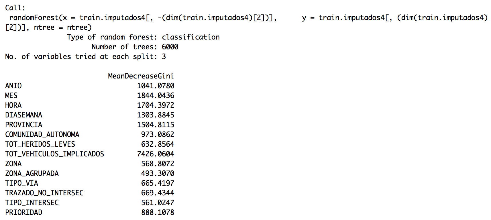
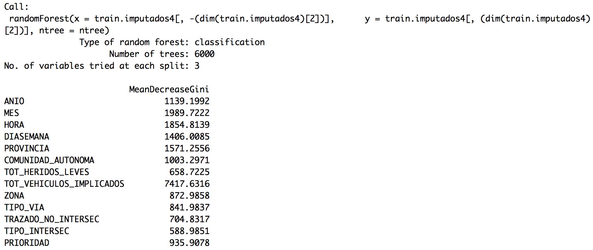

```{r setup, include=FALSE}
knitr::opts_chunk$set(echo = TRUE, cache = TRUE)
#setwd("E:/0Descargas/JDownloader/2 Mineria de datos, preprocesamiento y clasificacion")
setwd("~/Dropbox/zMaster/zRStudio/Master-en-Ciencia-De-Datos-e-Ingeniería-de-Computadores/2 Mineria de datos, preprocesamiento y clasificacion")
library(party)
library(FSelector)
library(mlbench)
library(ggplot2)
library(Hmisc)
library(fBasics)
library(mice)
library(outliers)
library(caret)
library(rpart)
library(pROC)
library(class)
library(randomForest)
library(Boruta)
library(NoiseFiltersR)
library(AppliedPredictiveModeling)
library(e1071)
library(adabag)
library("foreach")
library("doSNOW")
```

\newpage

# Introducción al problema y a Kaggel
Lo primero que se pretende realizar en este apartado es leer el dataset que nos han dado y realizar una subida a la plataforma Kaggel para obtener una primera puntuación.
Mi usuario en Kaggel es "PacoPollos".

## Lectura del dataset accidentes
Vamos a leer tanto los archivos de train como test dados.
```{r }
accidentes.train.original <- read.csv("accidentes-kaggle.csv")
accidentes.test.original <- read.csv("accidentes-kaggle-test.csv")
```

Una vez leídos vamos a realizar un summary para ver como están compuestos los datos.
```{r }
summary(accidentes.train.original)
```

Vemos como las variables TTO_VICTIMAS, TOT_MUERTOS, TOT_HERIDOS_GRAVES, TOT_HERIDOS_LEVES y TOT_VEHICULOS_IMPLICADOS son las únicas variables numéricas, por lo que nos quedaremos con ellas para la primera prueba, junto con la variable clasificadora TIPO_ACCIDENTE.
```{r }
accidentes.train.solo.numericos <- accidentes.train.original[,c(8,9,10,11,12,30)]
accidentes.test.solo.numericos <- accidentes.test.original[,c(8,9,10,11,12)]
```

## Primera prueba con un modelo
Lo primero es, con las variables numéricas únicamente, voy a realizar un primer modelo, que será un árbol, para predecir la clase del conjunto de test y comprobar el funcionamiento de Kaggel al no tener experiencia anterior.
```{r }
set.seed(1234)
ct1 <- ctree(TIPO_ACCIDENTE ~., accidentes.train.solo.numericos)
testPred1 <- predict(ct1, newdata = accidentes.test.solo.numericos)
```

Por lo que ya tenemos el conjunto de test predicho. Además el árbol creado tendría la siguiente estructura:
```{r }
ct1
```

## Creación del archivo de salida y subida a kaggel
Vamos a escribir la salida del primer modelo para ver su puntuación en Kaggel.
```{r }
salida.primer.modelo <- as.matrix(testPred1)
salida.primer.modelo <- cbind(c(1:(dim(salida.primer.modelo)[1])), salida.primer.modelo)
colnames(salida.primer.modelo) <- c("Id","Prediction")
write.table(salida.primer.modelo,file="predicciones/PrimeraPrediccion.txt",sep=",",quote = F,row.names = F)
```

1 Por lo que ya tenemos un fichero con la salida del conjunto de test. Lo único que tendremos que modificar es la primera linea del archivo para añadir "Id, Prediction".
El resultado de este primer modelo para la competición de Kaggel, subido el 11/02/2017 a las 19:54, con un total de 5 personas entregadas, se ha quedado en la posición 3 con una puntuación del 0.73246. 


# Análisis del dataset
Una vez realizada la primera prueba en Kaggel, vamos a analizar con detalle el dataset que nos han dado.

## Eliminación de valores perdidos

Anteriormente en el summary, hemos visto que hay variables con valores perdidos, ya que por ejemplo, en la variable CARRETERA uno de los valores que más se repite es NA's. Por lo tanto, vamos a analizar que variables contienen valores perdidos.
```{r, results=FALSE}
porcentaje.de.valores.perdidos.por.columna.train <- apply(accidentes.train.original,2,function(x) sum(is.na(x))) / ncol(accidentes.train.original) * 100
columnas.train.con.valores.perdidios <- (porcentaje.de.valores.perdidos.por.columna.train > 0)
columnas.train.con.valores.perdidios
```

Por lo que tenemos que las variables con valores perdidos son: CARRETERA, ACOND_CALZADA, PRIORIDAD, VISIBILIDAD_RESTRINGIDA, OTRA_CIRCUNSTANCIA, ACERAS, DENSIDAD_CIRCULACION y MEDIDAS_ESPECIALES. 
Veamos el resumen para esas variables.
```{r}
summary(accidentes.train.original[c("CARRETERA","ACOND_CALZADA","PRIORIDAD", "VISIBILIDAD_RESTRINGIDA", "OTRA_CIRCUNSTANCIA", "ACERAS", "DENSIDAD_CIRCULACION", "MEDIDAS_ESPECIALES")])
```

Donde podemos ver que el valor más pequeño de NA's es para la variable ACERAS con 3149 instancias con valores perdidos, lo que sería un 10,49% de los datos. Un 25% de los datos de este train serían unas 7500 instancias, por lo que las variables que tienen más del 25% de valores perdidos son: CARRETERA, ACOND_CALZADA, PRIORIDAD, VISIBILIDAD_RESTRINGIDA, DENSIDAD_CIRCULACION y MEDIDAS_ESPECIALES. O lo que es lo mismo, me quedo con las variables OTRA_CIRCUNSTANCIA y ACERAS, del anterior grupo. Pero además voy a comenzar eliminando esas variables ya que a mi juicio pueden no tener demasiada importancia.
```{r}
primeras.variables.eliminadas <- c("CARRETERA","ACOND_CALZADA","PRIORIDAD", "VISIBILIDAD_RESTRINGIDA", "DENSIDAD_CIRCULACION", "MEDIDAS_ESPECIALES", "OTRA_CIRCUNSTANCIA", "ACERAS")
accidentes.train.sin.variables.1 <- accidentes.train.original[,-c(15,20,21,25,26,27,28,29)]
accidentes.train.variables.eliminadas <- accidentes.train.original[,c(15,20,21,25,26,27,28,29)]
```

Por lo que guardo en una variable las variables que he eliminado, y creo mi dataset sin variables con valores NA. Hago lo mismo para el test:
```{r}
accidentes.test.sin.variables.1 <- accidentes.test.original[,-c(15,20,21,25,26,27,28,29)]
accidentes.test.variables.eliminadas <- accidentes.test.original[,c(15,20,21,25,26,27,28,29)]
accidentes.test.variables.eliminadas.copia <- accidentes.test.variables.eliminadas
```

Pensemos ahora que variables restantes pueden ser no interesantes.
```{r}
summary(accidentes.train.sin.variables.1)
```

Podemos pensar que otras de las variables que puede que no nos sean de mucha utilidad pueden ser: ANIO, MES, HORA, DIASEMANA, PROVINCIA, COMUNIDAD_AUTONOMA, ISLA, ZONA_AGRUPADA, TIPO_VIA, TRAZADO_NO_INTERSEC, TIPO_INTERSEC, SUPERFICIE_CALZADA y LUMINOSIDAD. Ya que muchas de estas variables podrían no ser de vital importancia, de primera mano, para la obtención de la predicción del tipo de accidente. Por lo tanto, vamos a eliminarlas de momento para agilizar los modelos primeros.
```{r}
segundas.variables.eliminadas <- c("ANIO", "MES", "HORA", "DIASEMANA", "PROVINCIA", "COMUNIDAD_AUTONOMA", "ISLA", "ZONA_AGRUPADA", "TIPO_VIA", "TRAZADO_NO_INTERSEC", "TIPO_INTERSEC", "SUPERFICIE_CALZADA", "LUMINOSIDAD")
accidentes.train.sin.variables.2 <- accidentes.train.sin.variables.1[,-c(1,2,3,4,5,6,7,14,16,17,18,19,20)]
accidentes.train.variables.eliminadasa <- cbind(accidentes.train.variables.eliminadas ,accidentes.train.sin.variables.1[,c(1,2,3,4,5,6,7,14,16,17,18,19,20)])
accidentes.test.sin.variables.2 <- accidentes.test.sin.variables.1[,-c(1,2,3,4,5,6,7,14,16,17,18,19,20)]
accidentes.test.variables.eliminadas <- cbind(accidentes.test.sin.variables.2 ,accidentes.test.original[,c(1,2,3,4,5,6,7,14,16,17,18,19,20)])
```

## Prueba del modelo con eliminación de variables
Hagamos por lo tanto una prueba de como afecta la inclusión de estas variables con respecto a la primera prueba realizada.
```{r }
set.seed(1234)
ct2 <- ctree(TIPO_ACCIDENTE ~., accidentes.train.sin.variables.2)
testPred2 <- predict(ct2, newdata = accidentes.test.sin.variables.2)
```

Por lo que ya tenemos el conjunto de test predicho. Además el árbol creado tendría la siguiente estructura:
```{r }
#ct2
```

Vamos a escribir la salida del modelo para ver su puntuación en Kaggel.
```{r }
salida.segundo.modelo <- as.matrix(testPred2)
salida.segundo.modelo <- cbind(c(1:(dim(salida.segundo.modelo)[1])), salida.segundo.modelo)
colnames(salida.segundo.modelo) <- c("Id","Prediction")
write.table(salida.segundo.modelo,file="predicciones/SegundaPrediccion.txt",sep=",",quote = F,row.names = F)
```

2 El resultado de este modelo para la competición de Kaggel, subido el 17/02/2017 a las 17:51, con un total de 14 personas entregadas, se ha quedado en la posición 9 con una puntuación del 0.81891. 


# Vusualización del dataset
Como no se ha hecho antes, y debería ser uno de los primeros pasos a realizar, vamos a realizar una visualización del dataset. 

## Análisis de las variables actuales
Vamos a ver el comportamiento de nuestras variables con respecto al TIPO_ACCIDENTE, a ver que relación pueden tener.
```{r fig.width=5, fig.height=3}
ggplot(data = accidentes.train.sin.variables.2) + geom_point(mapping = aes(x = TOT_VICTIMAS , y = TIPO_ACCIDENTE))
```

Podemos ver como para a partir de 10 victimas, el accidente suele ser o una colisión de vehículos, salida de vía, o muy pocas veces otro tipo de accidente. Por lo que puede ser una relación interesante. 
```{r fig.width=5, fig.height=3}
ggplot(data = accidentes.train.sin.variables.2) + geom_point(mapping = aes(x = TOT_MUERTOS , y = TIPO_ACCIDENTE))
ggplot(data = accidentes.train.sin.variables.2) + geom_point(mapping = aes(x = TOT_HERIDOS_GRAVES , y = TIPO_ACCIDENTE))
ggplot(data = accidentes.train.sin.variables.2) + geom_point(mapping = aes(x = TOT_HERIDOS_LEVES , y = TIPO_ACCIDENTE))
ggplot(data = accidentes.train.sin.variables.2) + geom_point(mapping = aes(x = TOT_VEHICULOS_IMPLICADOS , y = TIPO_ACCIDENTE))
```

Normalmente a partir de 3 muertos, el accidente es una colisión de vehículos o una salida de vía. Si hay más de 3 heridos graves, suele ser colisión de vehículos, salida de vía o vuelco. A partir de 6 heridos leves el accidente es una colisión, una salida de vía, un vuelco o otro accidente. A partir de 6 vehículos implicados, los accidentes suelen ser colisiones, salida de vía u otro tipo. 
Por lo que ya tenemos varias relaciones que podrían ser representadas en un árbol. 

```{r fig.width=5, fig.height=3}
ggplot(data = accidentes.train.sin.variables.1) + geom_bar(mapping = aes(x=TIPO_ACCIDENTE, fill=ZONA))
```

Podemos ver como las zonas predominantes son carretera y zona urbana, pero no parece que esta variable pueda ser influyente a la hora de decir que tipo de accidente se produce por lo que eliminaré esta variable para futuras pruebas.
```{r}
ggplot(data = accidentes.train.sin.variables.1) + geom_bar(mapping = aes(x=TIPO_ACCIDENTE, fill=RED_CARRETERA))
```

Puede parecer que esta variable no tiene demasiado que ver con la variable que queremos predecir por lo que puede ser que la descartemos.
```{r fig.width=5, fig.height=3}
ggplot(data = accidentes.train.sin.variables.1) + geom_bar(mapping = aes(x=TIPO_ACCIDENTE, fill=FACTORES_ATMOSFERICOS))
```

Por el conocimiento que tenemos, seguramente esta variable no sea demasiado importante para el tipo de accidente. Veamos que le ocurre si eliminamos los elementos que tienen buen tiempo.
```{r fig.width=5, fig.height=3}
vector.buen.tiempo <- accidentes.train.sin.variables.1$FACTORES_ATMOSFERICOS == "BUEN TIEMPO"
valores.sin.buen.tiempo <- accidentes.train.sin.variables.1[!vector.buen.tiempo,]
ggplot(data = valores.sin.buen.tiempo) + geom_bar(mapping = aes(x=TIPO_ACCIDENTE, fill=FACTORES_ATMOSFERICOS))
```

Pero seguimos viendo que no se puede sacar ninguna conclusión de esta visualización. 

## Análisis de variables eliminadas sin valores perdidos
Recordemos las variables que eliminamos sin tener valores perdidos.
```{r}
segundas.variables.eliminadas
```

Una de la variables que podrían ser interesantes es TIPO_VIA, TRAZADO_NO_INTERSEC, TIPO_INTERSEC, SUPERFICIE_CALZADA y LUMINOSIDAD. Veamos visualizaciones de estas variables.
```{r fig.width=5, fig.height=3}
ggplot(data = accidentes.train.sin.variables.1) + geom_bar(mapping = aes(x=TIPO_ACCIDENTE, fill=TIPO_VIA))
```

Eliminemos las instancias con OTRO TIPO o VIA CONVENCIONAL
```{r fig.width=5, fig.height=3}
vector.sin.otrotipo.y.viaconvencional <- ((accidentes.train.sin.variables.1$TIPO_VIA == "OTRO TIPO") | (accidentes.train.sin.variables.1$TIPO_VIA == "VIA CONVENCIONAL") )
valores.sin.otrotipo.y.viaconvencional <- accidentes.train.sin.variables.1[!vector.sin.otrotipo.y.viaconvencional,]
ggplot(data = valores.sin.otrotipo.y.viaconvencional) + geom_bar(mapping = aes(x=TIPO_ACCIDENTE, fill=TIPO_VIA))
```

No se observa que sea una variable demasiada importante.
```{r fig.width=8, fig.height=3}
ggplot(data = accidentes.train.sin.variables.1) + geom_bar(mapping = aes(x=TIPO_ACCIDENTE, fill=TRAZADO_NO_INTERSEC))
```

```{r fig.width=5, fig.height=3}
ggplot(data = accidentes.train.sin.variables.1) + geom_bar(mapping = aes(x=TIPO_ACCIDENTE, fill=TIPO_INTERSEC))
ggplot(data = accidentes.train.sin.variables.1) + geom_bar(mapping = aes(x=TIPO_ACCIDENTE, fill=SUPERFICIE_CALZADA))
ggplot(data = accidentes.train.sin.variables.1) + geom_bar(mapping = aes(x=TIPO_ACCIDENTE, fill=LUMINOSIDAD))
```

Por lo que no podemos sacar demasiada información así que no añadiremos ninguna a las que ya estamos usando de momento.

# Visión preeliminar de los datos
Como anteriormente ya hicimos el summary, no será necesario volver a hacerlo. Lo que si vamos a hacer es un str, para obtener la información de las variables.
```{r}
str(accidentes.train.sin.variables.1)
```

Si queremos información más detallada:
```{r}
describe(accidentes.train.sin.variables.2[1])
```

Esto lo podemos hacer con las variables que veamos oportunas. 
Otra forma de ver más información es:
```{r}
basicStats(accidentes.train.sin.variables.2[1])
```

# Imputación de valores perdidos
Vamos a usar uso del paquete mice para imputar los datos.

## Imputación de variables
Veamos que variables teníamos con valores perdidos.
```{r}
summary(accidentes.train.variables.eliminadas)
```

Vemos que dos de estas variables que podrían ser más interesantes son visibilidad restringida y prioridad, por lo que vamos a proceder a imputar sus valores perdidos.
```{r, results="hide"}
accidentes.train.a.imputar <- cbind(accidentes.train.sin.variables.2, accidentes.train.variables.eliminadas[,3:4])
accidentes.test.a.imputar <- cbind(accidentes.test.sin.variables.2, accidentes.test.variables.eliminadas.copia[,3:4])
set.seed(1234)
train.imputados.incompletos <- mice::mice(accidentes.train.a.imputar, m=1, method="pmm")
train.imputados <- mice::complete(train.imputados.incompletos)
test.imputados.incompletos <- mice::mice(accidentes.test.a.imputar, m=5, method="pmm")
test.imputados <- mice::complete(test.imputados.incompletos)
```

## Prueba del modelo con imputación de valores perdidos
Hagamos por lo tanto una prueba de como afecta la imputación de valores perdidos.
```{r }
set.seed(1234)
ct3 <- ctree(TIPO_ACCIDENTE ~., train.imputados)
testPred3 <- predict(ct3, newdata = test.imputados)
```

Por lo que ya tenemos el conjunto de test predicho. Además el árbol creado tendría la siguiente estructura:
```{r }
#ct3
```

Vamos a escribir la salida del modelo para ver su puntuación en Kaggel.
```{r }
salida.tercer.modelo <- as.matrix(testPred3)
salida.tercer.modelo <- cbind(c(1:(dim(salida.tercer.modelo)[1])), salida.tercer.modelo)
colnames(salida.tercer.modelo) <- c("Id","Prediction")
write.table(salida.tercer.modelo,file="predicciones/TerceraPrediccion.txt",sep=",",quote = F,row.names = F)
```

3 El resultado de este modelo para la competición de Kaggel, subido el 19/02/2017 a las 17:42, con un total de 14 personas entregadas, se ha quedado en la posición 9 con una puntuación del 0.81753. Bajando muy poco con respecto a la anterior puntuación.  


# Detección de anomalias
Veamos como detectar valores anómalos en nuestros datos.

## Uso del paquete outliers
Veamos si tenemos valores perdidos en nuestros datos, solo con valores que no son discretas.
```{r fig.width=5, fig.height=3}
valores.anomalos <- outliers::outlier(train.imputados[,1:5])
print(valores.anomalos)
ggplot(data = train.imputados) + geom_bar(mapping = aes(x=TOT_VICTIMAS))
ggplot(data = train.imputados) + geom_bar(mapping = aes(x=TOT_MUERTOS))
ggplot(data = train.imputados) + geom_bar(mapping = aes(x=TOT_HERIDOS_GRAVES))
ggplot(data = train.imputados) + geom_bar(mapping = aes(x=TOT_HERIDOS_LEVES))
ggplot(data = train.imputados) + geom_bar(mapping = aes(x=TOT_VEHICULOS_IMPLICADOS))
```

Viendo que en cada variable tenemos distintos valores anómalos como sería el valor 19 en TOT_VICTIMAS. 

## Paquete mvoutlier
Voy a intentar usar el paquete mvoutlier.
```{r}
require(mvoutlier)
#resultado.busqueda.anomalias <- uni.plot(train.imputados[1:200,1:2])
```

Como se puede ver, se ha obtenido un error el cual no he podido solucionar.

## Eliminación de valores anómalos
En función de lo obtenido con el paquete outlier, voy a intentar realizar algo con este paquete para ver que tal se comporta nuestro dataset.
```{r}
valores.anomalos.train <- outliers::outlier(train.imputados[,1:5])
valores.anomalos.test <- outliers::outlier(test.imputados[,1:5])
print(valores.anomalos.train)
print(valores.anomalos.test)
```

Veamos, por ejemplo, para la variable TOT_VICTIMAS, cuantas instancias cumplen tener mas de 19 victimas o de 10.
```{r}
vector.con.victimas.19 <- train.imputados$TOT_VICTIMAS >= 19
sum(vector.con.victimas.19)
vector.con.victimas.18 <- train.imputados$TOT_VICTIMAS >= 18
sum(vector.con.victimas.18)
vector.con.victimas.17 <- train.imputados$TOT_VICTIMAS >=17
sum(vector.con.victimas.17)
vector.con.victimas.10 <- train.imputados$TOT_VICTIMAS >= 10
sum(vector.con.victimas.10)
valores.con.victimas.10 <- train.imputados[vector.con.victimas.10,]
valores.con.victimas.10$TIPO_ACCIDENTE
```

Vemos que no son demasiados datos, ya que en total son 18 instancias, por lo que vamos a probar a eliminarlas a ver el comportamiento del paquete outlier de nuevo.
```{r  fig.width=5, fig.height=3}
train.sin.outliers <- train.imputados[!vector.con.victimas.10,]
valores.anomalos.sin.victimas.10 <- outliers::outlier(train.sin.outliers[,1:5])
print(valores.anomalos.sin.victimas.10)
ggplot(data = train.sin.outliers) + geom_bar(mapping = aes(x=TOT_VICTIMAS))
```

Vamos a probar a eliminar algunas instancias, con los criterios de otras variables.
```{r}
vector.con.muertos.7 <- train.sin.outliers$TOT_MUERTOS >=7
sum(vector.con.muertos.7)
vector.con.muertos.6 <- train.sin.outliers$TOT_MUERTOS >= 6
sum(vector.con.muertos.6)
vector.con.muertos.5 <- train.sin.outliers$TOT_MUERTOS >= 5
sum(vector.con.muertos.5)
vector.con.muertos.4 <- train.sin.outliers$TOT_MUERTOS >= 4
sum(vector.con.muertos.4)
train.sin.outliers <- train.sin.outliers[!vector.con.muertos.4,]
valores.anomalos.sin.muertos.4 <- outliers::outlier(train.sin.outliers[,1:5])
print(valores.anomalos.sin.muertos.4)
```

Vamos a realizarlo más rápidamente
```{r}
vector.con.anomalias <- ((train.sin.outliers$TOT_HERIDOS_GRAVES >= 6) | (train.sin.outliers$TOT_HERIDOS_LEVES >= 9) | (train.sin.outliers$TOT_VEHICULOS_IMPLICADOS >= 17) )
sum(vector.con.anomalias)
vector.con.anomalias <- ((train.sin.outliers$TOT_HERIDOS_GRAVES >= 5) | (train.sin.outliers$TOT_HERIDOS_LEVES >= 8) | (train.sin.outliers$TOT_VEHICULOS_IMPLICADOS >= 16) )
sum(vector.con.anomalias)
train.sin.outliers <- train.sin.outliers[!vector.con.anomalias,]
```

Pero, que pasaría si eliminamos en función de las anomalías que nos marca el test:
```{r}
print(valores.anomalos.test)
vector.con.anomalias <- ((train.imputados$TOT_HERIDOS_GRAVES > 5) | (train.imputados$TOT_HERIDOS_LEVES > 10) | (train.imputados$TOT_VEHICULOS_IMPLICADOS > 11) | (train.imputados$TOT_VICTIMAS > 10) | (train.imputados$TOT_MUERTOS > 5) )
sum(vector.con.anomalias)
```

En total eliminaríamos 14 instancias. Vamos a comprobarlo:
```{r}
train.sin.outliers <- train.imputados[!vector.con.anomalias,]
valores.anomalos.train <- outliers::outlier(train.sin.outliers[,1:5])
print(valores.anomalos.train)
print(valores.anomalos.test)
```

## Prueba del modelo con imputación de valores perdidos
Hagamos por lo tanto una prueba de como afecta la imputación de valores perdidos.
```{r }
set.seed(1234)
ct4 <- ctree(TIPO_ACCIDENTE ~., train.sin.outliers)
testPred4 <- predict(ct4, newdata = test.imputados)
```

Por lo que ya tenemos el conjunto de test predicho. Además el árbol creado tendría la siguiente estructura:
```{r }
#ct4
```

Vamos a escribir la salida del modelo para ver su puntuación en Kaggel.
```{r }
salida.modelo.4 <- as.matrix(testPred4)
salida.modelo.4 <- cbind(c(1:(dim(salida.modelo.4)[1])), salida.modelo.4)
colnames(salida.modelo.4) <- c("Id","Prediction")
write.table(salida.modelo.4,file="predicciones/Prediccion4.txt",sep=",",quote = F,row.names = F)
```

4 El resultado de este modelo para la competición de Kaggel, subido el 19/02/2017 a las 20:12, con un total de 16 personas entregadas, se ha quedado en la posición 10 con una puntuación del 0.81753. Bajando muy poco con respecto a la anterior puntuación.  


# Transformación de los datos
Tal y como se vio en el guión de prácticas en el punto 7, vamos a aplicar la transformación para ver que tal nos funciona.

## Transformando los datos
Vamos a aplicar centrado y escalado sobre el conjunto de datos con los valores ya imputados, para las variables que se consideran continuas.
```{r}
valores.preprocesados <- caret::preProcess(train.sin.outliers[,1:5],method=c("center","scale"))
valores.transofrmados <- predict(valores.preprocesados,train.sin.outliers[,1:5])
train.transformado <- cbind(valores.transofrmados,train.sin.outliers[,6:11])
valores.preprocesados.test <- caret::preProcess(test.imputados[,1:5],method=c("center","scale"))
valores.transofrmados.test <- predict(valores.preprocesados.test,test.imputados[,1:5])
test.transformado <- cbind(valores.transofrmados.test,test.imputados[,6:10])
```

## Prueba del modelo con transformación de los datos
Hagamos por lo tanto una prueba de como afecta la transformación de los datos.
```{r }
set.seed(1234)
ct5 <- ctree(TIPO_ACCIDENTE ~., train.transformado)
testPred5 <- predict(ct5, newdata = test.transformado)
```

Por lo que ya tenemos el conjunto de test predicho. Además el árbol creado tendría la siguiente estructura:
```{r }
#ct5
```

Vamos a escribir la salida del modelo para ver su puntuación en Kaggel.
```{r }
salida.modelo.5 <- as.matrix(testPred5)
salida.modelo.5 <- cbind(c(1:(dim(salida.modelo.5)[1])), salida.modelo.5)
colnames(salida.modelo.5) <- c("Id","Prediction")
write.table(salida.modelo.5,file="predicciones/Prediccion5.txt",sep=",",quote = F,row.names = F)
```

5 El resultado de este modelo para la competición de Kaggel, subido el 20/02/2017 a las 13:15, con un total de 18 personas entregadas, se ha quedado en la posición 12 con una puntuación del 0.55147. Bajando mucho con respecto a la anterior puntuación, por lo que esta transformación no la tendremos en cuenta.  


# Discretización
Para este conjunto de datos no se realiza discretización ya que no tenemos variables continuas como para poder discretizarlas. 

# Selección de características
Para este apartado comenzaremos con los dataset originales.
```{r}
rm(list=ls()) 
train.original <- read.csv("accidentes-kaggle.csv")
test.original <- read.csv("accidentes-kaggle-test.csv")
```

## Paquete FSelector
### Aproximación filter: chi.squared
Determina los pesos de los atributos discretos usando el test de independencia chi-cuadrado (con respecto a la variable clase). 
Calculamos los pesos de los atributos: la medida devuelta indica el nivel de dependencia de cada atributo frente a la variable clase
```{r results="hide"}
set.seed(1234)
pesos <- FSelector::chi.squared(TIPO_ACCIDENTE~.,train.original)
pesos
```

Vamos a seleccionar los 7 mejores
```{r}
subset <- FSelector::cutoff.k(pesos, 7)
las.7.mas.importantes.chi.squared <- as.simple.formula(subset, "TIPO_ACCIDENTE")
las.7.mas.importantes.chi.squared
```

Por lo que vamos a montar un modelo con estas variables
```{r}
train.filter.chi.squared <- train.original[,c("TOT_VEHICULOS_IMPLICADOS","CARRETERA","ZONA_AGRUPADA","ZONA","ACERAS","PRIORIDAD","RED_CARRETERA","TIPO_ACCIDENTE")]
test.filter.chi.squared <- test.original[,c("TOT_VEHICULOS_IMPLICADOS","CARRETERA","ZONA_AGRUPADA","ZONA","ACERAS","PRIORIDAD","RED_CARRETERA")]
```

Vemos que la variable CARRETERA tiene un alto número de valores perdidos por lo que la vamos a descartar, a pesar de que la selección de características nos ha dicho que es importante.
```{r}
train.filter.chi.squared["CARRETERA"] <- NULL
test.filter.chi.squared["CARRETERA"] <- NULL
```

### Prueba del modelo
Hagamos por lo tanto una prueba.
```{r }
set.seed(1234)
ct6 <- ctree(TIPO_ACCIDENTE ~., train.filter.chi.squared)
testPred6 <- predict(ct6, newdata = test.filter.chi.squared)
```

Por lo que ya tenemos el conjunto de test predicho. Además el árbol creado tendría la siguiente estructura:
```{r }
#ct6
```

Vamos a escribir la salida del modelo para ver su puntuación en Kaggel.
```{r }
salida.modelo.6 <- as.matrix(testPred6)
salida.modelo.6 <- cbind(c(1:(dim(salida.modelo.6)[1])), salida.modelo.6)
colnames(salida.modelo.6) <- c("Id","Prediction")
write.table(salida.modelo.6,file="predicciones/Prediccion6.txt",sep=",",quote = F,row.names = F)
```

6 El resultado de este modelo para la competición de Kaggel, subido el 22/02/2017 a las 13:20, con un total de 21 personas entregadas, se ha quedado en la posición 13 con una puntuación del 0.82089. Mejorando a la que ya se tenia anteriormente, por lo que vemos que esta selección de características ha funcionado correctamente.  


### Aproximación filter: correlation
Busca los pesos de atributos continuos en base a medidas de correlación. Por lo tanto esta aproximación no podremos realizarla al tener la variable clase no numérica.  

### Aproximación filter: entropy.based
Encontraremos los pesos de los atributos discretos en base a su correlación con el atributo clase.
```{r}
set.seed(1234)
pesos <- FSelector::information.gain(TIPO_ACCIDENTE~., train.original)
subset <- cutoff.k(pesos,7)
los.7.mas.importantes.information.gain <- as.simple.formula(subset, "TIPO_ACCIDENTE")
los.7.mas.importantes.information.gain
```
```{r}
set.seed(1234)
pesos <- FSelector::gain.ratio(TIPO_ACCIDENTE~., train.original)
subset <- cutoff.k(pesos,7)
los.7.mas.importantes.gain.ratio <- as.simple.formula(subset, "TIPO_ACCIDENTE")
los.7.mas.importantes.gain.ratio
```
```{r}
set.seed(1234)
pesos <- FSelector::symmetrical.uncertainty(TIPO_ACCIDENTE~., train.original)
subset <- cutoff.k(pesos,7)
los.7.mas.importantes.symmetrical.uncertainty <- as.simple.formula(subset, "TIPO_ACCIDENTE")
los.7.mas.importantes.symmetrical.uncertainty
```

Por lo que en función de estas tres salidas tenemos que las variables más importantes serían: TOT_VEHICULOS_IMPLICADOS, CARRETERA, ZONA, ZONA_AGRUPADA, TIPO_VIA, TRAZADO_NO_INTERSEC, PRIORIDAD y RED_CARRETERA. El único que difiere entre algoritmos es PRIORIDAD y RED_CARRETERA.
Recordemos los que teníamos con chi.cuadrado:
```{r}
las.7.mas.importantes.chi.squared
```

Es decir, tenemos diferencias en ACERAS. Vamos a probar un modelo con todas las variables dadas por este nuevo método.
```{r}
train.filter.entropy.bases <- train.original[,c("TOT_VEHICULOS_IMPLICADOS","ZONA_AGRUPADA","ZONA","TIPO_VIA","PRIORIDAD","RED_CARRETERA","TRAZADO_NO_INTERSEC","TIPO_ACCIDENTE")]
test.filter.entropy.bases <- test.original[,c("TOT_VEHICULOS_IMPLICADOS","ZONA_AGRUPADA","ZONA","TIPO_VIA","PRIORIDAD","RED_CARRETERA","TRAZADO_NO_INTERSEC")]
```

Como anteriormente, hemos quitado la variable CARRETERA

### Prueba del modelo
Hagamos por lo tanto una prueba.
```{r }
set.seed(1234)
ct7 <- ctree(TIPO_ACCIDENTE ~., train.filter.entropy.bases)
testPred7 <- predict(ct7, newdata = test.filter.entropy.bases)
```

Por lo que ya tenemos el conjunto de test predicho. Además el árbol creado tendría la siguiente estructura:
```{r }
#ct7
```

Vamos a escribir la salida del modelo para ver su puntuación en Kaggel.
```{r }
salida.modelo.7 <- as.matrix(testPred7)
salida.modelo.7 <- cbind(c(1:(dim(salida.modelo.7)[1])), salida.modelo.7)
colnames(salida.modelo.7) <- c("Id","Prediction")
write.table(salida.modelo.7,file="predicciones/Prediccion7.txt",sep=",",quote = F,row.names = F)
```

7 El resultado de este modelo para la competición de Kaggel, subido el 22/02/2017 a las 14:00, con un total de 22 personas entregadas, se ha quedado en la posición 14 con una puntuación del 0.82227. Mejorando a la que ya se tenia anteriormente, por lo que vemos que esta selección de características ha funcionado mejor.  


### Aproximación filter: oneR
Método simple de cálculo de pesos para atributos discretos mediante el uso de reglas de asociación con un sólo término en el antecedente.

```{r}
pesos <- FSelector::oneR(TIPO_ACCIDENTE~., train.original)
subset <- cutoff.k(pesos,7)
los.7.mas.importantes.oneR <- as.simple.formula(subset,"TIPO_ACCIDENTE")
los.7.mas.importantes.oneR
```

Podemos ver que tenemos distintos atributos más importantes según este método, por lo que vamos aprobar que tal se comportan estos atributos.
```{r}
train.filter.oneR <- train.original[,c("ANIO","TOT_VEHICULOS_IMPLICADOS","ACERAS","DENSIDAD_CIRCULACION","ZONA_AGRUPADA","TOT_MUERTOS","TOT_VICTIMAS","TIPO_ACCIDENTE")]
test.filter.oneR <- test.original[,c("ANIO","TOT_VEHICULOS_IMPLICADOS","ACERAS","DENSIDAD_CIRCULACION","ZONA_AGRUPADA","TOT_MUERTOS","TOT_VICTIMAS")]
```

### Prueba del modelo
Hagamos por lo tanto una prueba.
```{r }
set.seed(1234)
ct8 <- ctree(TIPO_ACCIDENTE ~., train.filter.oneR)
testPred8 <- predict(ct8, newdata = test.filter.oneR)
```

Por lo que ya tenemos el conjunto de test predicho. Además el árbol creado tendría la siguiente estructura:
```{r }
#ct8
```

Vamos a escribir la salida del modelo para ver su puntuación en Kaggel.
```{r }
salida.modelo.8 <- as.matrix(testPred8)
salida.modelo.8 <- cbind(c(1:(dim(salida.modelo.8)[1])), salida.modelo.8)
colnames(salida.modelo.8) <- c("Id","Prediction")
write.table(salida.modelo.8,file="predicciones/Prediccion8.txt",sep=",",quote = F,row.names = F)
```

8 El resultado de este modelo para la competición de Kaggel, subido el 23/02/2017 a las 12:51, con un total de 22 personas entregadas, se ha quedado en la posición 14 con una puntuación del 0.81891. La cual no mejora a la mejor que ya teníamos.  


### Aproximación filter: relief
Algoritmo de búsqueda de pesos de atributos continuos y discretos en base a la distancia entre instancias.
```{r results="hide"}
pesos <- relief(TIPO_ACCIDENTE~., train.original, neighbours.count = 5, sample.size = 20)
pesos
```
```{r}
subset <- cutoff.k(pesos,7)
los.7.mas.importantes.relief <- as.simple.formula(subset,"TIPO_ACCIDENTE")
los.7.mas.importantes.relief
```

Vemos que los más importantes, según este método son: COMUNIDAD_AUTONOMA, PROVINCIA, MES, HORA, PRIORIDAD, ANIO y LUMINOSIDAD.

Vamos a probar que tal se comportan estos atributos. (HORA la elimino al tener un gran número de factores y ralentizar los cálculos)
```{r}
train.filter.relief <- train.original[,c("COMUNIDAD_AUTONOMA","PROVINCIA","MES","PRIORIDAD","ANIO","LUMINOSIDAD","TIPO_ACCIDENTE")]
test.filter.relief <- test.original[,c("COMUNIDAD_AUTONOMA","PROVINCIA","MES","PRIORIDAD","ANIO","LUMINOSIDAD")]
```

### Prueba del modelo
Hagamos por lo tanto una prueba.
```{r }
set.seed(1234)
ct9 <- ctree(TIPO_ACCIDENTE ~., train.filter.relief)
testPred9 <- predict(ct9, newdata = test.filter.relief)
```

Por lo que ya tenemos el conjunto de test predicho. Además el árbol creado tendría la siguiente estructura:
```{r }
#ct9
```

Vamos a escribir la salida del modelo para ver su puntuación en Kaggel.
```{r }
salida.modelo.9 <- as.matrix(testPred9)
salida.modelo.9 <- cbind(c(1:(dim(salida.modelo.9)[1])), salida.modelo.9)
colnames(salida.modelo.9) <- c("Id","Prediction")
write.table(salida.modelo.9,file="predicciones/Prediccion9.txt",sep=",",quote = F,row.names = F)
```

9 El resultado de este modelo para la competición de Kaggel, subido el 28/02/2017 a las 11:51, con un total de 26 personas entregadas, se ha quedado en la posición 16 con una puntuación del 0.59119. La cual empeora mucho a lo que ya se tenia, por lo que no es una buena selección de características.  


### Aproximación wrapper: cfs
Decir que todos los métodos propuestos de wrapper como: best.first.search, exhaustive.search, greedy.search y hill.climbing.search, no me han funcionado debido al tipo de datos que tenemos. Por contra, el método cfs si ha funcionado correctamente.

```{r}
set.seed(1234)
subset <- FSelector::cfs(TIPO_ACCIDENTE~.,train.original)
el.mejor.segun.cfs <- as.simple.formula(subset, "TIPO_ACCIDENTE")
el.mejor.segun.cfs
```

Siendo TOT_VEHICULOS_IMPLICADOS, la mejor característica, repitamos esto para obtener las 5 mejores, de forma que eliminamos la que mejor se obtiene. 
```{r}
set.seed(1234)
train.wrapper.cfs = train.original[,-12]
subset <- FSelector::cfs(TIPO_ACCIDENTE~.,train.wrapper.cfs)
el.mejor.segun.cfs <- as.simple.formula(subset, "TIPO_ACCIDENTE")
el.mejor.segun.cfs
```

Ahora obtenemos ZONA_AGRUPADA, CARRETERA y TRAZADO_NO_INTERSEC.

```{r}
set.seed(1234)
train.wrapper.cfs = train.original[,-c(12,14,15,18)]
subset <- FSelector::cfs(TIPO_ACCIDENTE~.,train.wrapper.cfs)
el.mejor.segun.cfs <- as.simple.formula(subset, "TIPO_ACCIDENTE")
el.mejor.segun.cfs
```

Obteniendo: TOT_HERIDOS_LEVES, ZONA, RED_CARRETERA, TIPO_VIA, TIPO_INTERSEC, PRIORIDAD, SUPERFICIE_CALZADA y ACERAS.

Por lo tanto, ya que tenemos muchas características, vamos a probar el modelo con todas, salvo CARRETERA.
```{r}
train.wrapper.cfs <- train.original[,c("TOT_VEHICULOS_IMPLICADOS","ZONA_AGRUPADA","TRAZADO_NO_INTERSEC","TOT_HERIDOS_LEVES","ZONA","RED_CARRETERA","TIPO_VIA","TIPO_INTERSEC","PRIORIDAD","SUPERFICIE_CALZADA","ACERAS","TIPO_ACCIDENTE")]
test.wrapper.cfs <- test.original[,c("TOT_VEHICULOS_IMPLICADOS","ZONA_AGRUPADA","TRAZADO_NO_INTERSEC","TOT_HERIDOS_LEVES","ZONA","RED_CARRETERA","TIPO_VIA","TIPO_INTERSEC","PRIORIDAD","SUPERFICIE_CALZADA","ACERAS")]
```

### Prueba del modelo
Hagamos por lo tanto una prueba.
```{r }
set.seed(1234)
ct10 <- ctree(TIPO_ACCIDENTE ~., train.wrapper.cfs)
testPred10 <- predict(ct10, newdata = test.wrapper.cfs)
```

Por lo que ya tenemos el conjunto de test predicho. Además el árbol creado tendría la siguiente estructura:
```{r }
#ct10
```

Vamos a escribir la salida del modelo para ver su puntuación en Kaggel.
```{r }
salida.modelo.10 <- as.matrix(testPred10)
salida.modelo.10 <- cbind(c(1:(dim(salida.modelo.10)[1])), salida.modelo.10)
colnames(salida.modelo.10) <- c("Id","Prediction")
write.table(salida.modelo.10,file="predicciones/Prediccion10.txt",sep=",",quote = F,row.names = F)
```

10 El resultado de este modelo para la competición de Kaggel, subido el 28/02/2017 a las 12:17, con un total de 26 personas entregadas, se ha quedado en la posición 15 con una puntuación del 0.82395. Por lo que se ha mejorado a la mejor obtenida por mi hasta el momento.  


### Aproximación wrapper: consistency
Probamos este método:
```{r}
set.seed(1234)
subset <- consistency(TIPO_ACCIDENTE~.,train.original)
el.mejor.segun.consistency <- as.simple.formula(subset, "TIPO_ACCIDENTE")
el.mejor.segun.consistency
```

Obteniendo 20 características como importantes, no apareciendo: ANIO, COMUNIDAD_AUTONOMA, ISLA, TOT_MUERTOS, TOT_HERIDOS_GRAVES, ZONA, ZONA_AGRUPADA, RED_CARRETERA, VISIBILIDAD_RESTRINGIDA.
Por lo tanto, ya que tenemos muchas características, vamos a ejecutar nuestro modelo. Quitando además CARRETERA al ralentizar los cálculos. 
```{r}
train.wrapper.consistency <- train.original[,c(2,3,4,5,8,11,12,17,18,19,20,21,22,23,24,26,27,28,29,30)]
test.wrapper.consistency <-  test.original[,c(2,3,4,5,8,11,12,17,18,19,20,21,22,23,24,26,27,28,29)]
```

### Prueba del modelo
Hagamos por lo tanto una prueba. Quitando además CARRETERA para realizar los cálculos más rápidamente. Además, para que nuestro árbol funcione, he eliminado la variable HORA, junto con MEDIDAS_ESPECIAL, al contener esta un factor que en test no aparece.
```{r }
train.wrapper.consistency <- train.wrapper.consistency[,-2]
test.wrapper.consistency <- test.wrapper.consistency[,-2]
train.wrapper.consistency <- train.wrapper.consistency[,-18]
test.wrapper.consistency <- test.wrapper.consistency[,-18]
set.seed(1234)
ct11 <- ctree(TIPO_ACCIDENTE ~., train.wrapper.consistency)
testPred11 <- predict(ct11, newdata = test.wrapper.consistency)
```

Por lo que ya tenemos el conjunto de test predicho. Además el árbol creado tendría la siguiente estructura:
```{r }
#ct11
```

Vamos a escribir la salida del modelo para ver su puntuación en Kaggel.
```{r }
salida.modelo.11 <- as.matrix(testPred11)
salida.modelo.11 <- cbind(c(1:(dim(salida.modelo.11)[1])), salida.modelo.11)
colnames(salida.modelo.11) <- c("Id","Prediction")
write.table(salida.modelo.11,file="predicciones/Prediccion11.txt",sep=",",quote = F,row.names = F)
```

11 El resultado de este modelo para la competición de Kaggel, subido el 01/03/2017 a las 16:56, con un total de 26 personas entregadas, se ha quedado en la posición 15 con una puntuación del 0.82237. Empeorando un poco a la mejor actual.  


### Aproximación embedded: random.forest.importance
Método de cálculo de pesos de importancia de atributos calculados sobre un modelo construido usando el algoritmo RandomForest. 
Al no funcionar este método con variables que tengan más de 53 categorías hemos tenido que eliminar algunas variables como: CARRETERA y HORA.
El tercer argumento con valor 1 significa la reducción en la media de fiabilidad predictiva.
```{r}
train.embedded.random.forest.importance <- train.original[,c(1,2,4,5,6,7,8,9,10,11,12,13,14,16,17,18,19,20,21,22,23,24,25,26,27,28,29,30)]
set.seed(1234)
pesos1 <- FSelector::random.forest.importance(TIPO_ACCIDENTE~.,train.embedded.random.forest.importance, importance.type = 1)
subset1 <- cutoff.k(pesos1,7)
los.7.mas.importantes.random.forest.importance1 <- as.simple.formula(subset1, "TIPO_ACCIDENTE")
los.7.mas.importantes.random.forest.importance1
```

El tercer argumento con valor 2 significa la reducción en la media de impureza de nodos. 
```{r}
set.seed(1234)
pesos2 <- FSelector::random.forest.importance(TIPO_ACCIDENTE~.,train.embedded.random.forest.importance, importance.type = 2)
subset2 <- cutoff.k(pesos2,7)
los.7.mas.importantes.random.forest.importance2 <- as.simple.formula(subset2, "TIPO_ACCIDENTE")
los.7.mas.importantes.random.forest.importance2
```

Saliendo con ambos métodos las mismas variables como las más importantes. 

```{r}
train.embedded.random.forest.importance <- train.original[,c("TOT_VEHICULOS_IMPLICADOS","PRIORIDAD","SUPERFICIE_CALZADA","TIPO_INTERSEC","ZONA","ZONA_AGRUPADA","TIPO_VIA","TIPO_ACCIDENTE")]
test.embedded.random.forest.importance <- test.original[,c("TOT_VEHICULOS_IMPLICADOS","PRIORIDAD","SUPERFICIE_CALZADA","TIPO_INTERSEC","ZONA","ZONA_AGRUPADA","TIPO_VIA")]
```

### Prueba del modelo
Hagamos por lo tanto una prueba. Quitando además CARRETERA para realizar los cálculos más rápidamente.
```{r }
set.seed(1234)
ct12 <- ctree(TIPO_ACCIDENTE ~., train.embedded.random.forest.importance)
testPred12 <- predict(ct12, newdata = test.embedded.random.forest.importance)
```

Por lo que ya tenemos el conjunto de test predicho. Además el árbol creado tendría la siguiente estructura:
```{r }
#ct12
```

Vamos a escribir la salida del modelo para ver su puntuación en Kaggel.
```{r }
salida.modelo.12 <- as.matrix(testPred12)
salida.modelo.12 <- cbind(c(1:(dim(salida.modelo.12)[1])), salida.modelo.12)
colnames(salida.modelo.12) <- c("Id","Prediction")
write.table(salida.modelo.12,file="predicciones/Prediccion12.txt",sep=",",quote = F,row.names = F)
```

12 El resultado de este modelo para la competición de Kaggel, subido el 01/03/2017 a las 16:32, con un total de 26 personas entregadas, se ha quedado en la posición 15 con una puntuación del 0.82326. Por lo que ha empeorado muy poco a la mejor obtenida por mi.  


## Paquete caret
Para este apartado comenzaremos con los dataset originales.
```{r}
rm(list=ls()) 
train.original <- read.csv("accidentes-kaggle.csv")
test.original <- read.csv("accidentes-kaggle-test.csv")
train.sin.na <- train.original[,c(1,2,3,4,5,6,7,8,9,10,11,12,13,14,16,17,18,19,22,23,24,30)]
test.sin.na <- test.original[,c(1,2,3,4,5,6,7,8,9,10,11,12,13,14,16,17,18,19,22,23,24)]
```

### Esquema de valoración con aprendizaje de random forest
Probemos este paquete
```{r}
train.caret <- train.sin.na[,-3]
set.seed(1234)
control <- caret::rfeControl(functions = rfFuncs, method = "cv", number = 10)
results <- caret::rfe(train.caret[,1:20], train.caret[,21],sizes=c(1:20),rfeControl=control)
results
predictors(results)
plot(results, type=c("g","o"),lw=2)
```

Por lo tanto nos quedamos con las variables: TOT_VEHICULOS_IMPLICADOS, SUPERFICI_CALZADA, COMUNIDAD_AUTONOMA, TRAZADO_NO_INTERSEC, TIPO_INTERSEC, FACTORES_ATMOSFERICOS y ZONA.
```{r}
train.caret <- train.caret[,c(11,18,5,16,17,20,12,21)]
test.caret <- test.sin.na[,c(12,19,6,17,18,21,13)]
```

### Prueba del modelo
Hagamos por lo tanto una prueba.
```{r }
set.seed(1234)
ct13 <- ctree(TIPO_ACCIDENTE ~., train.caret)
testPred13 <- predict(ct13, newdata = test.caret)
```

Por lo que ya tenemos el conjunto de test predicho. Además el árbol creado tendría la siguiente estructura:
```{r }
#ct13
```

Vamos a escribir la salida del modelo para ver su puntuación en Kaggel.
```{r }
salida.modelo.13 <- as.matrix(testPred13)
salida.modelo.13 <- cbind(c(1:(dim(salida.modelo.13)[1])), salida.modelo.13)
colnames(salida.modelo.13) <- c("Id","Prediction")
write.table(salida.modelo.13,file="predicciones/Prediccion13.txt",sep=",",quote = F,row.names = F)
```

13 El resultado de este modelo para la competición de Kaggel, subido el 03/03/2017 a las 12:44, con un total de 28 personas entregadas, se ha quedado en la posición 16 con una puntuación del 0.82286. Por lo que ha empeorado muy poco a la mejor obtenida por mi.  


## Paquete Boruta
Para este apartado comenzaremos con los dataset originales.
```{r 14a}
rm(list=ls()) 
train.original <- read.csv("accidentes-kaggle.csv")
test.original <- read.csv("accidentes-kaggle-test.csv")
train.sin.na <- train.original[,c(1,2,3,4,5,6,7,8,9,10,11,12,13,14,16,17,18,19,22,23,24,30)]
test.sin.na <- test.original[,c(1,2,3,4,5,6,7,8,9,10,11,12,13,14,16,17,18,19,22,23,24)]
```

### Obtención de estadísticas sobre los atributos

```{r 14b, results="hide"}
set.seed(1234)
Bor.son <- Boruta(TIPO_ACCIDENTE~.,data=train.sin.na,doTrace = 2)
```
```{r 14b2}
Bor.son
stats <- attStats(Bor.son)
```
```{r 14b3, results="hide"}
stats
```
```{r 14b4}
plot(normHits~meanImp, col=stats$decision, data=stats)
stats[stats$minImp > 20,]
```
Hemos visto como Boruta nos indica que el atributo que podemos quitar es ISLA, pero además he podado por minImp < 20, quedándome con los atributos: PROVINCIA, COMUNIDAD_AUTONOMA, TOT_HERIDOS_LEVES, TOT_VEHICULOS_IMPLICADOS, ZONA, ZONA_AGRUPADA, RED_CARRETERA, TIPO_VIA, TRAZADO_NO_INTERSEC, TIPO_INTERSEC, SUPERFICIE_CALZADA y FACTORES_ATMOSFERICOS.
Vamos a probar un modelo con estas variables.
```{r 14c}
train.boruta <- train.sin.na[,c(5,6,11,12,13,14,15,16,17,18,19,21,22)]
test.boruta <- test.sin.na[,c(5,6,11,12,13,14,15,16,17,18,19,21)]
```


### Prueba del modelo
Hagamos por lo tanto una prueba.
```{r 14d}
set.seed(1234)
ct14 <- ctree(TIPO_ACCIDENTE ~., train.boruta)
testPred14 <- predict(ct14, newdata = test.boruta)
```
Por lo que ya tenemos el conjunto de test predicho. Además el árbol creado tendría la siguiente estructura:
```{r 14e}
#ct14
```
Vamos a escribir la salida del modelo para ver su puntuación en Kaggel.
```{r 14f}
salida.modelo.14 <- as.matrix(testPred14)
salida.modelo.14 <- cbind(c(1:(dim(salida.modelo.14)[1])), salida.modelo.14)
colnames(salida.modelo.14) <- c("Id","Prediction")
write.table(salida.modelo.14,file="predicciones/Prediccion14.txt",sep=",",quote = F,row.names = F)
```
14 El resultado de este modelo para la competición de Kaggel, subido el 03/03/2017 a las 12:47, con un total de 28 personas entregadas, se ha quedado en la posición 16 con una puntuación del 0.82326. Por lo que ha empeorado muy poco a la mejor obtenida por mi.  


### Combinación con random forest
```{r 15a}
rm(list=ls()) 
train.original <- read.csv("accidentes-kaggle.csv")
test.original <- read.csv("accidentes-kaggle-test.csv")
train.sin.na <- train.original[,c(1,2,3,4,5,6,7,8,9,10,11,12,13,14,16,17,18,19,22,23,24,30)]
test.sin.na <- test.original[,c(1,2,3,4,5,6,7,8,9,10,11,12,13,14,16,17,18,19,22,23,24)]
```

```{r 15b}
train.boruta.random.forest <- train.sin.na[,-3]
set.seed(1234)
Bor.ran <- Boruta(TIPO_ACCIDENTE~.,data=train.boruta.random.forest,doTrace=2)
```
```{r 15c}
model1 <- randomForest(TIPO_ACCIDENTE~.,data=train.boruta.random.forest)
model1
```
```{r 15d}
model2 <- randomForest(train.boruta.random.forest[,getSelectedAttributes(Bor.ran)],train.boruta.random.forest$TIPO_ACCIDENTE)
model2
```
```{r 15e}
Bor.ran
```
```{r 15f}
plot(Bor.ran)
```

Vemos como el atributo que nos indica que se puede eliminar es ISLA.
Probemos el modelo sin esta variable.
```{r 15g}
train.boruta.random.forest <- train.boruta.random.forest[,-6]
test.boruta.random.forest <- test.sin.na[,-3]
test.boruta.random.forest <- test.boruta.random.forest[,-6]
```

### Prueba del modelo
Hagamos por lo tanto una prueba.
```{r 15h}
set.seed(1234)
ct15 <- ctree(TIPO_ACCIDENTE ~., train.boruta.random.forest)
testPred15 <- predict(ct15, newdata = test.boruta.random.forest)
```
Por lo que ya tenemos el conjunto de test predicho. Además el árbol creado tendría la siguiente estructura:
```{r 15i}
#ct15
```
Vamos a escribir la salida del modelo para ver su puntuación en Kaggel.
```{r 15j}
salida.modelo.15 <- as.matrix(testPred15)
salida.modelo.15 <- cbind(c(1:(dim(salida.modelo.15)[1])), salida.modelo.15)
colnames(salida.modelo.15) <- c("Id","Prediction")
write.table(salida.modelo.15,file="predicciones/Prediccion15.txt",sep=",",quote = F,row.names = F)
```
15 El resultado de este modelo para la competición de Kaggel, subido el 03/03/2017 a las 12:51, con un total de 28 personas entregadas, se ha quedado en la posición 16 con una puntuación del 0.82286. Por lo que ha empeorado muy poco a la mejor obtenida por mi.  


# Detección de ruido
```{r 16a}
rm(list=ls()) 
train.original <- read.csv("accidentes-kaggle.csv")
test.original <- read.csv("accidentes-kaggle-test.csv")
train.sin.na <- train.original[,c(1,2,3,4,5,6,7,8,9,10,11,12,13,14,16,17,18,19,22,23,24,30)]
test.sin.na <- test.original[,c(1,2,3,4,5,6,7,8,9,10,11,12,13,14,16,17,18,19,22,23,24)]
```
Vamos a probar este método. 
```{r 16b}
out <- IPF(TIPO_ACCIDENTE~., data=train.original,s=2)
#summary(out, explicit=TRUE)
identical(out$cleanData, train.original[setdiff(1:nrow(train.original),out$remIdx),])
train.sin.ruido1 <- train.original[setdiff(1:nrow(train.original),out$remIdx),]
```
```{r 16c}
set.seed(1234)
out <- IPF(TIPO_ACCIDENTE~., data=train.sin.ruido1,s=2)
#summary(out, explicit=TRUE)
train.sin.ruido2 <- train.sin.ruido1[setdiff(1:nrow(train.sin.ruido1),out$remIdx),]
```
```{r 16d}
set.seed(1234)
out <- IPF(TIPO_ACCIDENTE~., data=train.sin.ruido2,s=2)
#summary(out, explicit=TRUE)
train.sin.ruido3 <- train.sin.ruido2[setdiff(1:nrow(train.sin.ruido2),out$remIdx),]
```
```{r 16e}
set.seed(1234)
out <- IPF(TIPO_ACCIDENTE~., data=train.sin.ruido3,s=2)
#summary(out, explicit=TRUE)
train.sin.ruido4 <- train.sin.ruido3[setdiff(1:nrow(train.sin.ruido3),out$remIdx),]
```
```{r 16f}
set.seed(1234)
out <- IPF(TIPO_ACCIDENTE~., data=train.sin.ruido4,s=2)
#summary(out, explicit=TRUE)
train.sin.ruido5 <- train.sin.ruido4[setdiff(1:nrow(train.sin.ruido4),out$remIdx),]
```
```{r 16g}
numero.de.eliminadas <- nrow(train.original)-nrow(train.sin.ruido5)
numero.de.eliminadas
```

Por lo que se han eliminado en total 1537 instancias al ser ruido, pero podrían ser más o menos, depende del número de pasadas que se decidan hacer. 

Hagamos ahora un selección de características, con el mejor método hasta ahora, cfs, para crear un modelo y realizar una prueba.
```{r 16h}
set.seed(1234)
subset <- FSelector::cfs(TIPO_ACCIDENTE~.,train.sin.ruido5)
el.mejor.segun.cfs <- as.simple.formula(subset, "TIPO_ACCIDENTE")
el.mejor.segun.cfs
```

Siendo TOT_VEHICULOS_IMPLICADOS, la mejor característica, repitamos esto para obtener las 5 mejores, de forma que eliminamos la que mejor se obtiene. 
```{r 16i}
set.seed(1234)
train.wrapper.cfs = train.sin.ruido5[,-12]
subset <- FSelector::cfs(TIPO_ACCIDENTE~.,train.wrapper.cfs)
```
```{r 16j}
el.mejor.segun.cfs <- as.simple.formula(subset, "TIPO_ACCIDENTE")
el.mejor.segun.cfs
```

Ahora obtenemos ZONA_AGRUPADA, CARRETERA y TRAZADO_NO_INTERSEC.

```{r 16k}
set.seed(1234)
train.wrapper.cfs = train.sin.ruido5[,-c(12,14,15,18)]
subset <- FSelector::cfs(TIPO_ACCIDENTE~.,train.wrapper.cfs)
```
```{r 16l}
el.mejor.segun.cfs <- as.simple.formula(subset, "TIPO_ACCIDENTE")
el.mejor.segun.cfs
```

Obteniendo: TOT_HERIDOS_LEVES, ZONA, RED_CARRETERA, TIPO_VIA, TIPO_INTERSEC, PRIORIDAD, SUPERFICIE_CALZADA y ACERAS.

Por lo tanto, ya que tenemos muchas características, vamos a probar el modelo con todas, salvo CARRETERA.
```{r 16m}
train.deteccion.de.ruido <- train.sin.ruido5[,c("TOT_VEHICULOS_IMPLICADOS","ZONA_AGRUPADA","TRAZADO_NO_INTERSEC","TOT_HERIDOS_LEVES","ZONA","RED_CARRETERA","TIPO_VIA","TIPO_INTERSEC","PRIORIDAD","SUPERFICIE_CALZADA","ACERAS","TIPO_ACCIDENTE")]
test.deteccion.de.ruido <- test.original[,c("TOT_VEHICULOS_IMPLICADOS","ZONA_AGRUPADA","TRAZADO_NO_INTERSEC","TOT_HERIDOS_LEVES","ZONA","RED_CARRETERA","TIPO_VIA","TIPO_INTERSEC","PRIORIDAD","SUPERFICIE_CALZADA","ACERAS")]
```

Vamos a probar este modelo.

### Prueba del modelo
Hagamos por lo tanto una prueba.
```{r 16n}
set.seed(1234)
ct16 <- ctree(TIPO_ACCIDENTE ~., train.deteccion.de.ruido)
testPred16 <- predict(ct16, newdata = test.deteccion.de.ruido)
```
Por lo que ya tenemos el conjunto de test predicho. Además el árbol creado tendría la siguiente estructura:
```{r 16o}
#ct16
```
Vamos a escribir la salida del modelo para ver su puntuación en Kaggel.
```{r 16p}
salida.modelo.16 <- as.matrix(testPred16)
salida.modelo.16 <- cbind(c(1:(dim(salida.modelo.16)[1])), salida.modelo.16)
colnames(salida.modelo.16) <- c("Id","Prediction")
write.table(salida.modelo.16,file="predicciones/Prediccion16.txt",sep=",",quote = F,row.names = F)
```

16 El resultado de este modelo para la competición de Kaggel, subido el 03/03/2017 a las 13:00, con un total de 28 personas entregadas, se ha quedado en la posición 16 con una puntuación del 0.82365. Por lo que ha empeorado muy poco a la mejor obtenida por mi, cosa que no era de esperar ya que es el mismo modelo que el mejor obtenido, pero eliminando instancias de ruido.  


# Modelo SVM Radial
Limpiamos el espacio de trabajo
```{r 17a}
rm(list=ls()) 
train.original <- read.csv("accidentes-kaggle.csv")
test.original <- read.csv("accidentes-kaggle-test.csv")
train.sin.na <- train.original[,c(1,2,3,4,5,6,7,8,9,10,11,12,13,14,16,17,18,19,22,23,24,30)]
test.sin.na <- test.original[,c(1,2,3,4,5,6,7,8,9,10,11,12,13,14,16,17,18,19,22,23,24)]
train.mejor.resultado.sin.na <- train.original[,c("TOT_VEHICULOS_IMPLICADOS","ZONA_AGRUPADA","TRAZADO_NO_INTERSEC","TOT_HERIDOS_LEVES","ZONA","RED_CARRETERA","TIPO_VIA","TIPO_INTERSEC","SUPERFICIE_CALZADA","TIPO_ACCIDENTE")]
test.mejor.resultado.sin.na <- test.original[,c("TOT_VEHICULOS_IMPLICADOS","ZONA_AGRUPADA","TRAZADO_NO_INTERSEC","TOT_HERIDOS_LEVES","ZONA","RED_CARRETERA","TIPO_VIA","TIPO_INTERSEC","SUPERFICIE_CALZADA")]
```

Vamos a aplicar el modelo SVM Radial a nuestros datos.
```{r 17b}
set.seed(1234)
modelo.svm.radial <- train(TIPO_ACCIDENTE ~., data = train.mejor.resultado.sin.na, methods = "svmRadial")
predicciciones.svm.radial <- predict(modelo.svm.radial, test.mejor.resultado.sin.na)
```

Veamos la puntuación en kaggel
```{r 17c}
salida.modelo.17 <- as.matrix(predicciciones.svm.radial)
salida.modelo.17 <- cbind(c(1:(dim(salida.modelo.17)[1])), salida.modelo.17)
colnames(salida.modelo.17) <- c("Id","Prediction")
write.table(salida.modelo.17,file="predicciones/Prediccion17.txt",sep=",",quote = F,row.names = F)
```

17 El resultado de este modelo para la competición de Kaggel, subido el 04/03/2017 a las 16:28, con un total de 29 personas entregadas, se ha quedado en la posición 16 con una puntuación del 0.81762.   


Si lo que queremos es preprocesar los datos con un centrado y escalado
```{r 18a}
set.seed(1234)
modelo.svm.radial2 <- train(TIPO_ACCIDENTE ~., data = train.mejor.resultado.sin.na, methods = "svmRadial", preProc = c("center", "scale"))
predicciciones.svm.radial2 <- predict(modelo.svm.radial2, test.mejor.resultado.sin.na)
```

Veamos la puntuación en kaggel
```{r 18b}
salida.modelo.18 <- as.matrix(predicciciones.svm.radial2)
salida.modelo.18 <- cbind(c(1:(dim(salida.modelo.18)[1])), salida.modelo.18)
colnames(salida.modelo.18) <- c("Id","Prediction")
write.table(salida.modelo.18,file="predicciones/Prediccion18.txt",sep=",",quote = F,row.names = F)
```

18 El resultado de este modelo para la competición de Kaggel, subido el 04/03/2017 a las 17:43, con un total de 29 personas entregadas, se ha quedado en la posición 16 con una puntuación del 0.81822.   


Este método tiene un parámetro de coste que regula el coste asociado a los errores de predicción: las diferencias entre el valor predicho y el real. Es posible evaluar diferentes valores de coste directamente:
```{r 19a}
set.seed(1234)
modelo.svm.radial3 <- train(TIPO_ACCIDENTE ~., data = train.mejor.resultado.sin.na, methods = "svmRadial", preProc = c("center", "scale"), tuneLength = 10)
predicciciones.svm.radial3 <- predict(modelo.svm.radial3, test.mejor.resultado.sin.na)
```
Veamos la puntuación en kaggel
```{r 19b}
salida.modelo.19 <- as.matrix(predicciciones.svm.radial3)
salida.modelo.19 <- cbind(c(1:(dim(salida.modelo.19)[1])), salida.modelo.19)
colnames(salida.modelo.19) <- c("Id","Prediction")
write.table(salida.modelo.19,file="predicciones/Prediccion19.txt",sep=",",quote = F,row.names = F)
```
19 El resultado de este modelo para la competición de Kaggel, subido el 05/03/2017 a las 12:15, con un total de 31 personas entregadas, se ha quedado en la posición 16 con una puntuación del 0.82256.   


También se puede modificar esta llamada para que se utilicen diferentes particionados. Realicemos 2 repeticiones de validación cruzada con k = 10. 
```{r 20a}
set.seed(1234)
modelo.svm.radial4 <- train(TIPO_ACCIDENTE ~., data = train.mejor.resultado.sin.na, methods = "svmRadial", preProc = c("center", "scale"), tuneLength = 10, trControl = trainControl(method = "repeatedcv", repeats=5))
predicciciones.svm.radial4 <- predict(modelo.svm.radial4, test.mejor.resultado.sin.na)
```
Veamos la puntuación en kaggel
```{r 20b}
salida.modelo.20 <- as.matrix(predicciciones.svm.radial4)
salida.modelo.20 <- cbind(c(1:(dim(salida.modelo.20)[1])), salida.modelo.20)
colnames(salida.modelo.20) <- c("Id","Prediction")
write.table(salida.modelo.20,file="predicciones/Prediccion20.txt",sep=",",quote = F,row.names = F)
```
20 El resultado de este modelo para la competición de Kaggel, subido el 05/03/2017 a las 12:17, con un total de 31 personas entregadas, se ha quedado en la posición 16 con una puntuación del 0.82237.   


# SVM (Support Vector Machine)
Limpiamos el espacio de trabajo
```{r 21a}
rm(list=ls()) 
train.original <- read.csv("accidentes-kaggle.csv")
test.original <- read.csv("accidentes-kaggle-test.csv")
train.sin.na <- train.original[,c(1,2,3,4,5,6,7,8,9,10,11,12,13,14,16,17,18,19,22,23,24,30)]
test.sin.na <- test.original[,c(1,2,3,4,5,6,7,8,9,10,11,12,13,14,16,17,18,19,22,23,24)]
train.mejor.resultado.sin.na <- train.original[,c("TOT_VEHICULOS_IMPLICADOS","ZONA_AGRUPADA","TRAZADO_NO_INTERSEC","TOT_HERIDOS_LEVES","ZONA","RED_CARRETERA","TIPO_VIA","TIPO_INTERSEC","SUPERFICIE_CALZADA","TIPO_ACCIDENTE")]
test.mejor.resultado.sin.na <- test.original[,c("TOT_VEHICULOS_IMPLICADOS","ZONA_AGRUPADA","TRAZADO_NO_INTERSEC","TOT_HERIDOS_LEVES","ZONA","RED_CARRETERA","TIPO_VIA","TIPO_INTERSEC","SUPERFICIE_CALZADA")]
```
Vamos a probar esta técnica:
```{r 21b}
set.seed(1234)
modelo.svm <- e1071::svm(TIPO_ACCIDENTE~., data=train.mejor.resultado.sin.na, method="C-classification", kernel="radial", cost=10, gamma=0.1)
prediccion.svm <- predict(modelo.svm, test.mejor.resultado.sin.na)
```
Veamos la puntuación en kaggel
```{r 21c}
salida.modelo.21 <- as.matrix(prediccion.svm)
salida.modelo.21 <- cbind(c(1:(dim(salida.modelo.21)[1])), salida.modelo.21)
colnames(salida.modelo.21) <- c("Id","Prediction")
write.table(salida.modelo.21,file="predicciones/Prediccion21.txt",sep=",",quote = F,row.names = F)
```
21 El resultado de este modelo para la competición de Kaggel, subido el 05/03/2017 a las 12:26, con un total de 31 personas entregadas, se ha quedado en la posición 16 con una puntuación del 0.82296.   


# Métodos ensamble de construcción de conjuntos de modelos

## Bagging
Limpiamos el espacio de trabajo
```{r 22a}
rm(list=ls()) 
train.original <- read.csv("accidentes-kaggle.csv")
test.original <- read.csv("accidentes-kaggle-test.csv")
train.sin.na <- train.original[,c(1,2,3,4,5,6,7,8,9,10,11,12,13,14,16,17,18,19,22,23,24,30)]
test.sin.na <- test.original[,c(1,2,3,4,5,6,7,8,9,10,11,12,13,14,16,17,18,19,22,23,24)]
train.mejor.resultado.sin.na <- train.original[,c("TOT_VEHICULOS_IMPLICADOS","ZONA_AGRUPADA","TRAZADO_NO_INTERSEC","TOT_HERIDOS_LEVES","ZONA","RED_CARRETERA","TIPO_VIA","TIPO_INTERSEC","SUPERFICIE_CALZADA","TIPO_ACCIDENTE")]
test.mejor.resultado.sin.na <- test.original[,c("TOT_VEHICULOS_IMPLICADOS","ZONA_AGRUPADA","TRAZADO_NO_INTERSEC","TOT_HERIDOS_LEVES","ZONA","RED_CARRETERA","TIPO_VIA","TIPO_INTERSEC","SUPERFICIE_CALZADA")]
```

```{r 22b}
set.seed(1234)
modelo.bagging.1 <- adabag::bagging(TIPO_ACCIDENTE~.,data=train.mejor.resultado.sin.na, control=rpart::rpart.control(maxdepth=5, minsplit=15))
predicciones.bagging.1 <- adabag::predict.bagging(modelo.bagging.1,newdata=test.mejor.resultado.sin.na)

set.seed(1234)
modelo.bagging.2 <- adabag::bagging(TIPO_ACCIDENTE~.,data=train.mejor.resultado.sin.na,mfinal=20 ,control=rpart::rpart.control(maxdepth=3, minsplit=5))
predicciones.bagging.2 <- adabag::predict.bagging(modelo.bagging.2,newdata=test.mejor.resultado.sin.na)
```
Veamos la puntuación en kaggel
```{r 22c}
salida.modelo.22 <- as.matrix(predicciones.bagging.1$class)
salida.modelo.22 <- cbind(c(1:(dim(salida.modelo.22)[1])), salida.modelo.22)
colnames(salida.modelo.22) <- c("Id","Prediction")
write.table(salida.modelo.22,file="predicciones/Prediccion22.txt",sep=",",quote = F,row.names = F)
```
22 El resultado de este modelo para la competición de Kaggel, subido el 05/03/2017 a las 12:31, con un total de 31 personas entregadas, se ha quedado en la posición 16 con una puntuación del 0.81891.   

Veamos la puntuación en kaggel
```{r 23a}
salida.modelo.23 <- as.matrix(predicciones.bagging.2$class)
salida.modelo.23 <- cbind(c(1:(dim(salida.modelo.23)[1])), salida.modelo.23)
colnames(salida.modelo.23) <- c("Id","Prediction")
write.table(salida.modelo.23,file="predicciones/Prediccion23.txt",sep=",",quote = F,row.names = F)
```
23 El resultado de este modelo para la competición de Kaggel, subido el 05/03/2017 a las 12:37, con un total de 31 personas entregadas, se ha quedado en la posición 16 con una puntuación del 0.81891.   


## Random forest
Limpiamos el espacio de trabajo
```{r 24a}
rm(list=ls()) 
train.original <- read.csv("accidentes-kaggle.csv")
test.original <- read.csv("accidentes-kaggle-test.csv")
train.sin.na <- train.original[,c(1,2,3,4,5,6,7,8,9,10,11,12,13,14,16,17,18,19,22,23,24,30)]
test.sin.na <- test.original[,c(1,2,3,4,5,6,7,8,9,10,11,12,13,14,16,17,18,19,22,23,24)]
train.mejor.resultado.sin.na <- train.original[,c("TOT_VEHICULOS_IMPLICADOS","ZONA_AGRUPADA","TRAZADO_NO_INTERSEC","TOT_HERIDOS_LEVES","ZONA","RED_CARRETERA","TIPO_VIA","TIPO_INTERSEC","SUPERFICIE_CALZADA","TIPO_ACCIDENTE")]
test.mejor.resultado.sin.na <- test.original[,c("TOT_VEHICULOS_IMPLICADOS","ZONA_AGRUPADA","TRAZADO_NO_INTERSEC","TOT_HERIDOS_LEVES","ZONA","RED_CARRETERA","TIPO_VIA","TIPO_INTERSEC","SUPERFICIE_CALZADA")]
```

```{r 24b}
set.seed(1234)
modelo.random.forest.10 <- randomForest::randomForest(TIPO_ACCIDENTE~.,data=train.mejor.resultado.sin.na,ntree=10)
print(modelo.random.forest.10)
randomForest::importance(modelo.random.forest.10)
plot(modelo.random.forest.10)
predicciones.rf.10 <- predict(modelo.random.forest.10,newdata=test.mejor.resultado.sin.na)
```
Veamos la puntuación en kaggel
```{r 24c}
salida.modelo.24 <- as.matrix(predicciones.rf.10)
salida.modelo.24 <- cbind(c(1:(dim(salida.modelo.24)[1])), salida.modelo.24)
colnames(salida.modelo.24) <- c("Id","Prediction")
write.table(salida.modelo.24,file="predicciones/Prediccion24.txt",sep=",",quote = F,row.names = F)
```
24 El resultado de este modelo para la competición de Kaggel, subido el 06/03/2017 a las 10:54, con un total de 32 personas entregadas, se ha quedado en la posición 18 con una puntuación del 0.82089.  


```{r 25a}
set.seed(1234)
modelo.random.forest.100 <- randomForest::randomForest(TIPO_ACCIDENTE~.,data=train.mejor.resultado.sin.na,ntree=100)
print(modelo.random.forest.100)
randomForest::importance(modelo.random.forest.100)
plot(modelo.random.forest.100)
predicciones.rf.100 <- predict(modelo.random.forest.100,newdata=test.mejor.resultado.sin.na)
```
Veamos la puntuación en kaggel
```{r 25b}
salida.modelo.25 <- as.matrix(predicciones.rf.100)
salida.modelo.25 <- cbind(c(1:(dim(salida.modelo.25)[1])), salida.modelo.25)
colnames(salida.modelo.25) <- c("Id","Prediction")
write.table(salida.modelo.25,file="predicciones/Prediccion25.txt",sep=",",quote = F,row.names = F)
```
25 El resultado de este modelo para la competición de Kaggel, subido el 06/03/2017 a las 10:56, con un total de 32 personas entregadas, se ha quedado en la posición 18 con una puntuación del 0.82306.   


## Boosting
Limpiamos el espacio de trabajo
```{r 26a}
rm(list=ls()) 
train.original <- read.csv("accidentes-kaggle.csv")
test.original <- read.csv("accidentes-kaggle-test.csv")
train.sin.na <- train.original[,c(1,2,3,4,5,6,7,8,9,10,11,12,13,14,16,17,18,19,22,23,24,30)]
test.sin.na <- test.original[,c(1,2,3,4,5,6,7,8,9,10,11,12,13,14,16,17,18,19,22,23,24)]
train.mejor.resultado.sin.na <- train.original[,c("TOT_VEHICULOS_IMPLICADOS","ZONA_AGRUPADA","TRAZADO_NO_INTERSEC","TOT_HERIDOS_LEVES","ZONA","RED_CARRETERA","TIPO_VIA","TIPO_INTERSEC","SUPERFICIE_CALZADA","TIPO_ACCIDENTE")]
test.mejor.resultado.sin.na <- test.original[,c("TOT_VEHICULOS_IMPLICADOS","ZONA_AGRUPADA","TRAZADO_NO_INTERSEC","TOT_HERIDOS_LEVES","ZONA","RED_CARRETERA","TIPO_VIA","TIPO_INTERSEC","SUPERFICIE_CALZADA")]
```
Vamos a probar este método:
```{r 26b}
set.seed(1234)
modelo.boosting <- adabag::boosting(TIPO_ACCIDENTE~.,data=train.mejor.resultado.sin.na, mfinal = 10, control = rpart::rpart.control(maxdepth = 2))
barplot(modelo.boosting$imp[order(modelo.boosting$imp, decreasing = TRUE)],
           ylim = c(0, 100), main = "Variables Relative Importance",
           col = "lightblue")
prediccion.boosting <- predict.boosting(modelo.boosting, newdata = test.mejor.resultado.sin.na)
modelo.boosting$importance[modelo.boosting$importance>0]
```
Veamos la puntuación en kaggel
```{r 26c}
salida.modelo.26 <- as.matrix(prediccion.boosting$class)
salida.modelo.26 <- cbind(c(1:(dim(salida.modelo.26)[1])), salida.modelo.26)
colnames(salida.modelo.26) <- c("Id","Prediction")
write.table(salida.modelo.26,file="predicciones/Prediccion26.txt",sep=",",quote = F,row.names = F)
```
26 El resultado de este modelo para la competición de Kaggel, subido el 06/03/2017 a las 10:58, con un total de 32 personas entregadas, se ha quedado en la posición 18 con una puntuación del 0.81891.   


# Arboles de clasificación
Aunque todos los modelos que he realizado en este guión han sido con este método, voy a realizarlo de nuevo para ver su puntuación y compararlo con los métodos anteriores, ya que he usado otro conjunto de variables. 
```{r 27a}
set.seed(1234)
ct27 <- ctree(TIPO_ACCIDENTE ~., train.mejor.resultado.sin.na)
testPred27 <- predict(ct27, newdata = test.mejor.resultado.sin.na)
```

Veamos la puntuación en kaggel
```{r 27b}
salida.modelo.27 <- as.matrix(testPred27)
salida.modelo.27 <- cbind(c(1:(dim(salida.modelo.27)[1])), salida.modelo.27)
colnames(salida.modelo.27) <- c("Id","Prediction")
write.table(salida.modelo.27,file="predicciones/Prediccion27.txt",sep=",",quote = F,row.names = F)
```
27 El resultado de este modelo para la competición de Kaggel, subido el 06/03/2017 a las 10:59, con un total de 32 personas entregadas, se ha quedado en la posición 18 con una puntuación del 0.82000.   


# Primeras Conclusiones
Lo realizado hasta ahora ha sido lo visto durante el guión de preprocesamiento, reproduciendo lo visto en clase. A partir de ahora, voy a realizar nuevos modelos, usando lo visto hasta ahora, viendo como podemos conseguir el mejor modelo posible. Además el modelo que mejor resultado ha obtenido ha sido RandomForest.

\newpage


# Prueba de modelos
## Prueba del primer modelo random forest 1000
Como ya vimos, las variables con valores perdidos son: CARRETERA, ACOND_CALZADA, PRIORIDAD, VISIBILIDAD_RESTRINGIDA, OTRA_CIRCUNSTANCIA, ACERAS, DENSIDAD_CIRCULACION y MEDIDAS_ESPECIALES. 
Además, a modo de resumen, voy a ver las variables que, en selección de características, tenían mayor importancia:

Variable                   | Número de veces que ha sido seleccionada
-------------------------- | -----------------------------------------
ANIO                       | 2
MES                        | 3
HORA                       | 2
DIASEMANA                  | 2
PROVINCIA                  | 4
COMUNIDAD_AUTONOMA         | 4
TOT_VICTIMAS               | 2
TOT_MUERTOS                | 1
TOT_HERIDOS_LEVES          | 3
TOT_VEHICULOS_IMPLICADOS   | 11
ZONA                       | 8
ZONA_AGRUPADA              | 8
CARRETERA                  | 6
RED_CARRETERA              | 5
TIPO_VIA                   | 7
TRAZADO_NO_INTERSEC        | 7
TIPO_INTERSEC              | 6
ACOND_CALZADA              | 1
PRIORIDAD                  | 7
SUPERFICE_CALZADA          | 5
LUMINOSIDAD                | 2
FACTORES_ATMOSFERICOS      | 3
OTRA_CIRCUNSTANCIA         | 1
ACERAS                     | 4
DENSIDAD_CIRCULACION       | 2
MEDIDAS_ESPECIALES         | 1

Siendo, según esta clasificación las más importantes: 11 (TOT_VEHICULOS_IMPLICADOS), 8 (ZONA, ZONA_AGRUPADA), 7 (TIPO_VIA, TRAZADO_NO_INTERSEC,PRIORIDAD)
Además, viendo como las variables CARRETERA y HORA, tienen más de 53 factores, vamos discretizarlas en menos valores. Por ejemplo, vemos la variable HORA actualmente:
```{r 28a}
rm(list=ls()) 
train.original <- read.csv("accidentes-kaggle.csv")
test.original <- read.csv("accidentes-kaggle-test.csv")
valores.hora <- train.original[,3]
valores.hora.character <- as.character(valores.hora)
valores.hora.cortados <- unlist(lapply(valores.hora.character,function(x) strtrim(x,2)))
valores.hora.factor <- as.factor(valores.hora.cortados)
levels(valores.hora.factor) <- c("0", "0", "1","1","10","11","12","13","14","15","16","17","18","19","2","2","20","21","22","23","3","3","4","4","5","5","6","6","7","7","8","8","9","9")
train.modelos <- train.original
train.modelos$HORA = valores.hora.factor
valores.hora <- test.original[,3]
valores.hora.character <- as.character(valores.hora)
valores.hora.cortados <- unlist(lapply(valores.hora.character,function(x) strtrim(x,2)))
valores.hora.factor <- as.factor(valores.hora.cortados)
levels(valores.hora.factor) <- c("0", "0", "1","1","10","11","12","13","14","15","16","17","18","19","2","2","20","21","22","23","3","3","4","4","5","5","6","6","7","7","8","8","9","9")
test.modelos <- test.original
test.modelos$HORA = valores.hora.factor
```
Además, viendo que Carretera tiene 3268 niveles, y que no es fácilmente discretizable, voy a eliminarla del conjunto de datos.
```{r 28b}
train.modelos$CARRETERA = NULL
test.modelos$CARRETERA = NULL
```
Como tenemos varias variables que tienen valores perdidos, vamos a imputar estos valores.
```{r 28c, results="hide"}
set.seed(1234)
train.modelos.imputados <- mice::mice(train.modelos,m=5,method="pmm")
train.imputados <- mice::complete(train.modelos.imputados)
set.seed(1234)
test.modelos.imputados <- mice::mice(test.modelos,m=5,method="pmm")
test.imputados <- mice::complete(test.modelos.imputados)
```
Escribimos los datos imputados en un csv para que su carga sea mucho más rápida:
```{r 28d}
write.csv(train.imputados,"datasetmodificados/train-imputados.csv")
write.csv(test.imputados,"datasetmodificados/test-imputados.csv")
```

Vamos a ver que variables son las más importantes según random forest y boosting:
Primero con RandomForest.
```{r 28e}
set.seed(1234)
modelo.random.forest.10 <- randomForest::randomForest(TIPO_ACCIDENTE~.,data=train.imputados,ntree=10)
print(modelo.random.forest.10)
randomForest::importance(modelo.random.forest.10)>100
plot(modelo.random.forest.10)
```
Por lo que las variables menos importantes serían: ISLA, TOT_MUERTOS y MEDIDAS_ESPECIALES. Vamos a probar un nuevo árbol sin estas variables.
```{r 28f}
train.imputados2 <- train.imputados
test.imputados2 <- test.imputados
train.imputados2$ISLA=NULL
train.imputados2$TOT_MUERTOS = NULL
train.imputados2$MEDIDAS_ESPECIALES =NULL
test.imputados2$ISLA=NULL
test.imputados2$TOT_MUERTOS = NULL
test.imputados2$MEDIDAS_ESPECIALES =NULL
set.seed(1234)
modelo.random.forest.50 <- randomForest::randomForest(TIPO_ACCIDENTE~.,data=train.imputados2,ntree=50)
print(modelo.random.forest.50)
randomForest::importance(modelo.random.forest.50)
plot(modelo.random.forest.50)
```
Tenemos varias variables que podrían ser eliminadas, pero de momento las vamos a dejar. Veamos que puntuación obtenemos en kaggel con un randomForest de 1000 arboles.
```{r 28g}
set.seed(1234)
modelo.random.forest.1000 <- randomForest::randomForest(TIPO_ACCIDENTE~.,data=train.imputados2,ntree=1000)
print(modelo.random.forest.1000)
randomForest::importance(modelo.random.forest.1000)
plot(modelo.random.forest.1000)
predicciones.rf.1000 <- predict(modelo.random.forest.1000,newdata=test.imputados2)
```
Veamos la puntuación en kaggel
```{r 28h}
salida.modelo.28 <- as.matrix(predicciones.rf.1000)
salida.modelo.28 <- cbind(c(1:(dim(salida.modelo.28)[1])), salida.modelo.28)
colnames(salida.modelo.28) <- c("Id","Prediction")
write.table(salida.modelo.28,file="predicciones/Prediccion28.txt",sep=",",quote = F,row.names = F)
```
28 El resultado de este modelo para la competición de Kaggel, subido el 06/03/2017 a las 15:04, con un total de 32 personas entregadas, se ha quedado en la posición 9 con una puntuación del 0.82859. Mi mejor puntuación obtenida hasta el momento.   


## Prueba del segundo modelo random forest 1000

```{r 29a}
rm(list=ls()) 
train.imputados <- read.csv("datasetmodificados/train-imputados.csv")
train.imputados$X = NULL
test.imputados <- read.csv("datasetmodificados/test-imputados.csv")
test.imputados$X = NULL
```
Vamos a probar a eliminar las variables: ISLA, TOT_MUERTOS, TOT_HERIDOS_GRAVES, ACERAS y MEDIDAS_ESPECIALES, es decir, dos más que anteriormente.
```{r 29b}
train.imputados3 <- train.imputados
test.imputados3 <- test.imputados
train.imputados3$ISLA = NULL
train.imputados3$TOT_MUERTOS=NULL
train.imputados3$TOT_HERIDOS_GRAVES=NULL
train.imputados3$ACERAS=NULL
train.imputados3$MEDIDAS_ESPECIALES=NULL
test.imputados3$ISLA = NULL
test.imputados3$TOT_MUERTOS=NULL
test.imputados3$TOT_HERIDOS_GRAVES=NULL
test.imputados3$ACERAS=NULL
test.imputados3$MEDIDAS_ESPECIALES=NULL
```

```{r 29c}
set.seed(1234)
modelo.random.forest.1000.3 <- randomForest::randomForest(TIPO_ACCIDENTE~.,data=train.imputados3,ntree=1000)
print(modelo.random.forest.1000.3)
randomForest::importance(modelo.random.forest.1000.3)
plot(modelo.random.forest.1000.3)
predicciones.rf.1000.3 <- predict(modelo.random.forest.1000.3,newdata=test.imputados3)
```

Veamos la puntuación en kaggel
```{r 29d}
salida.modelo.29 <- as.matrix(predicciones.rf.1000.3)
salida.modelo.29 <- cbind(c(1:(dim(salida.modelo.29)[1])), salida.modelo.29)
colnames(salida.modelo.29) <- c("Id","Prediction")
write.table(salida.modelo.29,file="predicciones/Prediccion29.txt",sep=",",quote = F,row.names = F)
```
29 El resultado de este modelo para la competición de Kaggel, subido el 07/03/2017 a las 13:17, con un total de 34 personas entregadas, se ha quedado en la posición 7 con una puntuación del 0.82909. Mi mejor puntuación hasta el momento.   


## Prueba del tercer modelo random forest 1000

```{r 30a}
train.imputados4 <- train.imputados3
test.imputados4 <- test.imputados3
train.imputados4$VISIBILIDAD_RESTRINGIDA=NULL
train.imputados4$OTRA_CIRCUNSTANCIA=NULL
train.imputados4$DENSIDAD_CIRCULACION=NULL
test.imputados4$VISIBILIDAD_RESTRINGIDA=NULL
test.imputados4$OTRA_CIRCUNSTANCIA=NULL
test.imputados4$DENSIDAD_CIRCULACION=NULL
```

```{r 30b}
write.csv(train.imputados4,"datasetmodificados/train-imputados4.csv",row.names = FALSE)
write.csv(test.imputados4,"datasetmodificados/test-imputados4.csv",row.names = FALSE)
```

```{r 30c}
set.seed(1234)
modelo.random.forest.1000.4 <- randomForest::randomForest(TIPO_ACCIDENTE~.,data=train.imputados4,ntree=1000)
print(modelo.random.forest.1000.4)
randomForest::importance(modelo.random.forest.1000.4)
plot(modelo.random.forest.1000.4)
predicciones.rf.1000.4 <- predict(modelo.random.forest.1000.4,newdata=test.imputados4)
```
Veamos la puntuación en kaggel
```{r 30d}
salida.modelo.30 <- as.matrix(predicciones.rf.1000.4)
salida.modelo.30 <- cbind(c(1:(dim(salida.modelo.30)[1])), salida.modelo.30)
colnames(salida.modelo.30) <- c("Id","Prediction")
write.table(salida.modelo.30,file="predicciones/Prediccion30.txt",sep=",",quote = F,row.names = F)
```
30 El resultado de este modelo para la competición de Kaggel, subido el 07/03/2017 a las 16:17, con un total de 34 personas entregadas, se ha quedado en la posición 5 con una puntuación del 0.82958. La mejor obtenida hasta el momento. 


## Prueba del cuarto modelo random forest 1000

```{r 31a}
train.imputados5 <- train.imputados4
test.imputados5 <- test.imputados4
train.imputados5$FACTORES_ATMOSFERICOS   =NULL
train.imputados5$TOT_VICTIMAS   =NULL
test.imputados5$FACTORES_ATMOSFERICOS  =NULL
test.imputados5$TOT_VICTIMAS  =NULL
```

```{r 31b}
set.seed(1234)
modelo.random.forest.1000.5 <- randomForest::randomForest(TIPO_ACCIDENTE~.,data=train.imputados5,ntree=1000)
print(modelo.random.forest.1000.5)
randomForest::importance(modelo.random.forest.1000.5)
plot(modelo.random.forest.1000.5)
predicciones.rf.1000.5 <- predict(modelo.random.forest.1000.5,newdata=test.imputados5)
```
Veamos la puntuación en kaggel
```{r 31c}
salida.modelo.31 <- as.matrix(predicciones.rf.1000.5)
salida.modelo.31 <- cbind(c(1:(dim(salida.modelo.31)[1])), salida.modelo.31)
colnames(salida.modelo.31) <- c("Id","Prediction")
write.table(salida.modelo.31,file="predicciones/Prediccion31.txt",sep=",",quote = F,row.names = F)
```
31 El resultado de este modelo para la competición de Kaggel, subido el 07/03/2017 a las 16:46, con un total de 34 personas entregadas, se ha quedado en la posición 5 con una puntuación del 0.82928. 


## Prueba del quinto modelo random forest 1000

```{r 32a}
train.imputados6 <- train.imputados5
test.imputados6 <- test.imputados5
train.imputados6$RED_CARRETERA=NULL
train.imputados6$SUPERFICIE_CALZADA=NULL
train.imputados6$LUMINOSIDAD=NULL
test.imputados6$RED_CARRETERA=NULL
test.imputados6$SUPERFICIE_CALZADA=NULL
test.imputados6$LUMINOSIDAD=NULL
```


```{r 32b}
set.seed(1234)
modelo.random.forest.1000.6 <- randomForest::randomForest(TIPO_ACCIDENTE~.,data=train.imputados6,ntree=1000)
print(modelo.random.forest.1000.6)
randomForest::importance(modelo.random.forest.1000.6)
plot(modelo.random.forest.1000.6)
predicciones.rf.1000.6 <- predict(modelo.random.forest.1000.6,newdata=test.imputados6)
```
Veamos la puntuación en kaggel
```{r 32c}
salida.modelo.32 <- as.matrix(predicciones.rf.1000.6)
salida.modelo.32 <- cbind(c(1:(dim(salida.modelo.32)[1])), salida.modelo.32)
colnames(salida.modelo.32) <- c("Id","Prediction")
write.table(salida.modelo.32,file="predicciones/Prediccion32.txt",sep=",",quote = F,row.names = F)
```
32 El resultado de este modelo para la competición de Kaggel, subido el 07/03/2017 a las 17:08, con un total de 34 personas entregadas, se ha quedado en la posición 5 con una puntuación del 0.82523. 


## Prueba del sexto modelo random forest 1000

```{r 33a}
train.imputados7 <- train.imputados6
test.imputados7 <- test.imputados6
train.imputados7$TOT_HERIDOS_LEVES=NULL
train.imputados7$TIPO_INTERSEC=NULL
train.imputados7$ACOND_CALZADA=NULL
test.imputados7$TOT_HERIDOS_LEVES=NULL
test.imputados7$TIPO_INTERSEC=NULL
test.imputados7$ACOND_CALZADA=NULL
```

```{r 33b}
set.seed(1234)
modelo.random.forest.1000.7 <- randomForest::randomForest(TIPO_ACCIDENTE~.,data=train.imputados7,ntree=1000)
print(modelo.random.forest.1000.7)
randomForest::importance(modelo.random.forest.1000.7)
plot(modelo.random.forest.1000.7)
predicciones.rf.1000.7 <- predict(modelo.random.forest.1000.7,newdata=test.imputados7)
```

Veamos la puntuación en kaggel
```{r 33c}
salida.modelo.33 <- as.matrix(predicciones.rf.1000.7)
salida.modelo.33 <- cbind(c(1:(dim(salida.modelo.33)[1])), salida.modelo.33)
colnames(salida.modelo.33) <- c("Id","Prediction")
write.table(salida.modelo.33,file="predicciones/Prediccion33.txt",sep=",",quote = F,row.names = F)
```
33 El resultado de este modelo para la competición de Kaggel, subido el 07/03/2017 a las 17:31, con un total de 34 personas entregadas, se ha quedado en la posición 5 con una puntuación del 0.82444. 


## Prueba del primer modelo random forest multihebra

Vamos a probar un random forest multihebra para ver si mejoramos los resultados:
```{r 34a}
set.seed(1234)
registerDoSNOW(makeCluster(8, type="SOCK"))

rf <- foreach(ntree = rep(250, 8), .combine = combine, .packages = "randomForest") %dopar% randomForest(train.imputados4[,-21], train.imputados4[,21], ntree = ntree)
rf
randomForest::importance(rf)
predicciones.rf <- predict(rf,newdata=test.imputados4)
```
Veamos la puntuación en kaggel
```{r 34b}
salida.modelo.34 <- as.matrix(predicciones.rf)
salida.modelo.34 <- cbind(c(1:(dim(salida.modelo.34)[1])), salida.modelo.34)
colnames(salida.modelo.34) <- c("Id","Prediction")
write.table(salida.modelo.34,file="predicciones/Prediccion34.txt",sep=",",quote = F,row.names = F)
```
34 El resultado de este modelo para la competición de Kaggel, subido el 08/03/2017 a las 08:55, con un total de 34 personas entregadas, se ha quedado en la posición 4 con una puntuación del 0.82978. La mejor obtenida hasta el momento.  


## Prueba del primer modelo random forest 5000

Probemos el mejor modelo obtenido pero con 5000 árboles en lugar de 1000.
```{r 35a}
set.seed(1234)
modelo.random.forest.5000.4 <- randomForest::randomForest(TIPO_ACCIDENTE~.,data=train.imputados4,ntree=5000)
print(modelo.random.forest.5000.4)
randomForest::importance(modelo.random.forest.5000.4)
plot(modelo.random.forest.5000.4)
predicciones.rf.5000.4 <- predict(modelo.random.forest.5000.4,newdata=test.imputados4)
```

Veamos la puntuación en kaggel
```{r 35b}
salida.modelo.35 <- as.matrix(predicciones.rf.5000.4)
salida.modelo.35 <- cbind(c(1:(dim(salida.modelo.35)[1])), salida.modelo.35)
colnames(salida.modelo.35) <- c("Id","Prediction")
write.table(salida.modelo.35,file="predicciones/Prediccion35.txt",sep=",",quote = F,row.names = F)
```
35 El resultado de este modelo para la competición de Kaggel, subido el 08/03/2017 a las 08:55, con un total de 34 personas entregadas, se ha quedado en la posición 4 con una puntuación del 0.82918. 


## Prueba del segundo modelo random forest multihebra

Ya que tenemos un muy buen modelo, vamos a probar a eliminar algo de ruido para ver el comportamiento de nuestro modelo. 
```{r 36a}
rm(list=ls()) 
train.imputados4 <- read.csv("datasetmodificados/train-imputados4.csv")
test.imputados4 <- read.csv("datasetmodificados/test-imputados4.csv")
```
Eliminamos ruido:
```{r 36b}
set.seed(1234)
out <- IPF(TIPO_ACCIDENTE~., data=train.imputados4,s=2)
identical(out$cleanData, train.imputados4[setdiff(1:nrow(train.imputados4),out$remIdx),])
train.sin.ruido1 <- train.imputados4[setdiff(1:nrow(train.imputados4),out$remIdx),]
```
Veamos como funciona nuestro nuevo dataset sin ruido con el modelo.
```{r 36c}
set.seed(1234)
registerDoSNOW(makeCluster(8, type="SOCK"))

rf.sin.ruido <- foreach(ntree = rep(250, 8), .combine = combine, .packages = "randomForest") %dopar% randomForest(train.sin.ruido1[,-21], train.sin.ruido1[,21], ntree = ntree)
rf.sin.ruido
randomForest::importance(rf.sin.ruido)
predicciones.rf.sin.ruido <- predict(rf.sin.ruido,newdata=test.imputados4)
```
Veamos la puntuación en kaggel
```{r 36d}
salida.modelo.36 <- as.matrix(predicciones.rf.sin.ruido)
salida.modelo.36 <- cbind(c(1:(dim(salida.modelo.36)[1])), salida.modelo.36)
colnames(salida.modelo.36) <- c("Id","Prediction")
write.table(salida.modelo.36,file="predicciones/Prediccion36.txt",sep=",",quote = F,row.names = F)
```
36 El resultado de este modelo para la competición de Kaggel, subido el 08/03/2017 a las 11:52, con un total de 36 personas entregadas, se ha quedado en la posición 4 con una puntuación del 0.82177.  


## Prueba del tercer modelo random forest multihebra
Como la detección de ruido no ha funcionado correctamente, vamos a probar a eliminar una nueva variable del mejor dataset que tenemos hasta ahora. Esta variable será TOT_VICTIMAS al ser la siguiente variable con menos importancia según el randomforest obtenido con 5000 árboles.

```{r 37a}
rm(list=ls()) 
train.multihebra <- read.csv("datasetmodificados/train-imputados4.csv")
test.multihebra <- read.csv("datasetmodificados/test-imputados4.csv")
train.multihebra$TOT_VICTIMAS=NULL
test.multihebra$TOT_VICTIMAS=NULL
```
Veamos como funciona en este modelo:
```{r 37b}
set.seed(1234)
registerDoSNOW(makeCluster(8, type="SOCK"))
rf.1 <- foreach(ntree = rep(250, 8), .combine = combine, .packages = "randomForest") %dopar% randomForest(train.multihebra[,-20], train.multihebra[,20], ntree = ntree)
rf.1
randomForest::importance(rf.1)
predicciones.rf.1 <- predict(rf.1,newdata=test.multihebra)
```
Veamos la puntuación en kaggel
```{r 37c}
salida.modelo.37 <- as.matrix(predicciones.rf.1)
salida.modelo.37 <- cbind(c(1:(dim(salida.modelo.37)[1])), salida.modelo.37)
colnames(salida.modelo.37) <- c("Id","Prediction")
write.table(salida.modelo.37,file="predicciones/Prediccion37.txt",sep=",",quote = F,row.names = F)
```
37 El resultado de este modelo para la competición de Kaggel, subido el 08/03/2017 a las 12:47, con un total de 36 personas entregadas, se ha quedado en la posición 4 con una puntuación del 0.82928.  


## Prueba del cuarto modelo random forest multihebra
```{r 38a}
rm(list=ls()) 
train.imputados4 <- read.csv("datasetmodificados/train-imputados4.csv")
test.imputados4 <- read.csv("datasetmodificados/test-imputados4.csv")
```
Vamos a probar un random forest multihebra con más árboles para ver si mejoramos los resultados:
```{r 38b}
set.seed(1234)
registerDoSNOW(makeCluster(8, type="SOCK"))

rf2 <- foreach(ntree = rep(500, 8), .combine = combine, .packages = "randomForest") %dopar% randomForest(train.imputados4[,-21], train.imputados4[,21], ntree = ntree)
rf2
randomForest::importance(rf2)
predicciones.rf2 <- predict(rf2,newdata=test.imputados4)
```
Veamos la puntuación en kaggel
```{r 38c}
salida.modelo.38 <- as.matrix(predicciones.rf2)
salida.modelo.38 <- cbind(c(1:(dim(salida.modelo.38)[1])), salida.modelo.38)
colnames(salida.modelo.38) <- c("Id","Prediction")
write.table(salida.modelo.38,file="predicciones/Prediccion38.txt",sep=",",quote = F,row.names = F)
```
38 El resultado de este modelo para la competición de Kaggel, subido el 08/03/2017 a las 12:53, con un total de 36 personas entregadas, se ha quedado en la posición 4 con una puntuación del 0.82968. La mejor obtenida hasta el momento.  


## Prueba del quinto modelo random forest multihebra
```{r 39a}
rm(list=ls()) 
train.imputados4 <- read.csv("datasetmodificados/train-imputados4.csv")
test.imputados4 <- read.csv("datasetmodificados/test-imputados4.csv")
```
Vamos a probar un random forest multihebra con más árboles para ver si mejoramos los resultados: (No lo he ejecutado para la creación del pdf ya que me da fallo de memoria, pero si lo ejecuto como un script normal de R no tengo ningún problema)
```{r 39b, eval=FALSE}
set.seed(1234)
registerDoSNOW(makeCluster(8, type="SOCK"))
rf3 <- foreach::foreach(ntree = rep(750, 8), .combine = combine, .packages = "randomForest") %dopar% randomForest(train.imputados4[,-21], train.imputados4[,21], ntree = ntree)
rf3
randomForest::importance(rf3)
predicciones.rf3 <- predict(rf3,newdata=test.imputados4)
```
Muestro la imagen que me ha proporcionado el script de R:




Veamos la puntuación en kaggel
```{r 39c, eval=FALSE}
salida.modelo.39 <- as.matrix(predicciones.rf3)
salida.modelo.39 <- cbind(c(1:(dim(salida.modelo.39)[1])), salida.modelo.39)
colnames(salida.modelo.39) <- c("Id","Prediction")
write.table(salida.modelo.39,file="predicciones/Prediccion39.txt",sep=",",quote = F,row.names = F)
```
39 El resultado de este modelo para la competición de Kaggel, subido el 08/03/2017 a las 08:55, con un total de 34 personas entregadas, se ha quedado en la posición 4 con una puntuación del 0.82978. La mejor obtenida hasta el momento.  


## Prueba del sexto modelo random forest multihebra
```{r 40a}
rm(list=ls()) 
train.imputados4 <- read.csv("datasetmodificados/train-imputados4.csv")
test.imputados4 <- read.csv("datasetmodificados/test-imputados4.csv")
```
Quito la variable TOT_VICTIMAS ya que en la última ejecución era la que peores resultados obtenía en la importancia.
```{r 40a2}
train.imputados4$TOT_VICTIMAS=NULL
test.imputados4$TOT_VICTIMAS=NULL
```
Vamos a probar un random forest multihebra con más árboles para ver si mejoramos los resultados: (No lo he ejecutado para la creación del pdf ya que me da fallo de memoria, pero si lo ejecuto como un script normal de R no tengo ningún problema)
```{r 40b, eval=FALSE}
set.seed(1234)
registerDoSNOW(makeCluster(8, type="SOCK"))
rf4 <- foreach::foreach(ntree = rep(750, 8), .combine = combine, .packages = "randomForest") %dopar% randomForest(train.imputados4[,-(dim(train.imputados4)[2])], train.imputados4[,(dim(train.imputados4)[2])], ntree = ntree)
rf4
randomForest::importance(rf4)
predicciones.rf4 <- predict(rf4,newdata=test.imputados4)
```

Muestro la imagen que me ha proporcionado el script de R:



Veamos la puntuación en kaggel
```{r 40c, eval=FALSE}
salida.modelo.40 <- as.matrix(predicciones.rf4)
salida.modelo.40 <- cbind(c(1:(dim(salida.modelo.40)[1])), salida.modelo.40)
colnames(salida.modelo.40) <- c("Id","Prediction")
write.table(salida.modelo.40,file="predicciones/Prediccion40.txt",sep=",",quote = F,row.names = F)
```
40 El resultado de este modelo para la competición de Kaggle, subido el 17/03/2017 a las 12:17, con un total de 43 personas entregadas, se ha quedado en la posición 8 con una puntuación del 0.82948.   


## Prueba del setimo modelo random forest multihebra
```{r 41a}
rm(list=ls()) 
train.imputados4 <- read.csv("datasetmodificados/train-imputados4.csv")
test.imputados4 <- read.csv("datasetmodificados/test-imputados4.csv")
```
Quito la variable FACTORES_ATMOSFERICOS ya que en la última ejecución era la que peores resultados obtenía en la importancia.
```{r 41a2}
train.imputados4$TOT_VICTIMAS=NULL
test.imputados4$TOT_VICTIMAS=NULL
train.imputados4$FACTORES_ATMOSFERICOS=NULL
test.imputados4$FACTORES_ATMOSFERICOS=NULL
```
Vamos a probar un random forest multihebra con más árboles para ver si mejoramos los resultados: (No lo he ejecutado para la creación del pdf ya que me da fallo de memoria, pero si lo ejecuto como un script normal de R no tengo ningún problema)
```{r 41b, eval=FALSE}
set.seed(1234)
registerDoSNOW(makeCluster(8, type="SOCK"))
rf5 <- foreach::foreach(ntree = rep(750, 8), .combine = combine, .packages = "randomForest") %dopar% randomForest(train.imputados4[,-(dim(train.imputados4)[2])], train.imputados4[,(dim(train.imputados4)[2])], ntree = ntree)
rf5
randomForest::importance(rf5)
predicciones.rf5 <- predict(rf5,newdata=test.imputados4)
```

Muestro la imagen que me ha proporcionado el script de R:



Veamos la puntuación en kaggel
```{r 41c, eval=FALSE}
salida.modelo.41 <- as.matrix(predicciones.rf5)
salida.modelo.41 <- cbind(c(1:(dim(salida.modelo.41)[1])), salida.modelo.41)
colnames(salida.modelo.41) <- c("Id","Prediction")
write.table(salida.modelo.41,file="predicciones/Prediccion41.txt",sep=",",quote = F,row.names = F)
```
41 El resultado de este modelo para la competición de Kaggle, subido el 17/03/2017 a las 12:45, con un total de 43 personas entregadas, se ha quedado en la posición 8 con una puntuación del 0.82869.  

## Prueba del octavo modelo random forest multihebra
```{r 42a}
rm(list=ls()) 
train.imputados4 <- read.csv("datasetmodificados/train-imputados4.csv")
test.imputados4 <- read.csv("datasetmodificados/test-imputados4.csv")
```
Quito la variable RED_CARRETERA ya que en la última ejecución era la que peores resultados obtenía en la importancia.
```{r 42a2}
train.imputados4$TOT_VICTIMAS=NULL
test.imputados4$TOT_VICTIMAS=NULL
train.imputados4$FACTORES_ATMOSFERICOS=NULL
test.imputados4$FACTORES_ATMOSFERICOS=NULL
train.imputados4$RED_CARRETERA=NULL
test.imputados4$RED_CARRETERA=NULL
```
Vamos a probar un random forest multihebra con más árboles para ver si mejoramos los resultados: (No lo he ejecutado para la creación del pdf ya que me da fallo de memoria, pero si lo ejecuto como un script normal de R no tengo ningún problema)
```{r 42b, eval=FALSE}
set.seed(1234)
registerDoSNOW(makeCluster(8, type="SOCK"))
rf6 <- foreach::foreach(ntree = rep(750, 8), .combine = combine, .packages = "randomForest") %dopar% randomForest(train.imputados4[,-(dim(train.imputados4)[2])], train.imputados4[,(dim(train.imputados4)[2])], ntree = ntree)
rf6
randomForest::importance(rf6)
predicciones.rf6 <- predict(rf6,newdata=test.imputados4)
```

Muestro la imagen que me ha proporcionado el script de R:



Veamos la puntuación en kaggel
```{r 42c, eval=FALSE}
salida.modelo.42 <- as.matrix(predicciones.rf6)
salida.modelo.42 <- cbind(c(1:(dim(salida.modelo.42)[1])), salida.modelo.42)
colnames(salida.modelo.42) <- c("Id","Prediction")
write.table(salida.modelo.42,file="predicciones/Prediccion42.txt",sep=",",quote = F,row.names = F)
```
42 El resultado de este modelo para la competición de Kaggle, subido el 17/03/2017 a las 13:22, con un total de 43 personas entregadas, se ha quedado en la posición 8 con una puntuación del 0.82869.  

## Prueba del noveno modelo random forest multihebra
```{r 43a}
rm(list=ls()) 
train.imputados4 <- read.csv("datasetmodificados/train-imputados4.csv")
test.imputados4 <- read.csv("datasetmodificados/test-imputados4.csv")
```
Quito la variable LUMINOSIDAD ya que en la última ejecución era la que peores resultados obtenía en la importancia.
```{r 43a2}
train.imputados4$TOT_VICTIMAS=NULL
test.imputados4$TOT_VICTIMAS=NULL
train.imputados4$FACTORES_ATMOSFERICOS=NULL
test.imputados4$FACTORES_ATMOSFERICOS=NULL
train.imputados4$RED_CARRETERA=NULL
test.imputados4$RED_CARRETERA=NULL
train.imputados4$LUMINOSIDAD=NULL
test.imputados4$LUMINOSIDAD=NULL
```
Vamos a probar un random forest multihebra con más árboles para ver si mejoramos los resultados: (No lo he ejecutado para la creación del pdf ya que me da fallo de memoria, pero si lo ejecuto como un script normal de R no tengo ningún problema)
```{r 43b, eval=FALSE}
set.seed(1234)
registerDoSNOW(makeCluster(8, type="SOCK"))
rf7 <- foreach::foreach(ntree = rep(750, 8), .combine = combine, .packages = "randomForest") %dopar% randomForest(train.imputados4[,-(dim(train.imputados4)[2])], train.imputados4[,(dim(train.imputados4)[2])], ntree = ntree)
rf7
randomForest::importance(rf7)
predicciones.rf7 <- predict(rf7,newdata=test.imputados4)
```

Muestro la imagen que me ha proporcionado el script de R:



Veamos la puntuación en kaggel
```{r 43c, eval=FALSE}
salida.modelo.43 <- as.matrix(predicciones.rf7)
salida.modelo.43 <- cbind(c(1:(dim(salida.modelo.43)[1])), salida.modelo.43)
colnames(salida.modelo.43) <- c("Id","Prediction")
write.table(salida.modelo.43,file="predicciones/Prediccion43.txt",sep=",",quote = F,row.names = F)
```
43 El resultado de este modelo para la competición de Kaggle, subido el 17/03/2017 a las 14:09, con un total de 43 personas entregadas, se ha quedado en la posición 8 con una puntuación del 0.82869.  


## Prueba del decimo modelo random forest multihebra
```{r 44a}
rm(list=ls()) 
train.imputados4 <- read.csv("datasetmodificados/train-imputados4.csv")
test.imputados4 <- read.csv("datasetmodificados/test-imputados4.csv")
```
Quito la variable SUPERFICIE_CALZADA ya que en la última ejecución era la que peores resultados obtenía en la importancia.
```{r 44a2}
train.imputados4$TOT_VICTIMAS=NULL
test.imputados4$TOT_VICTIMAS=NULL
train.imputados4$FACTORES_ATMOSFERICOS=NULL
test.imputados4$FACTORES_ATMOSFERICOS=NULL
train.imputados4$RED_CARRETERA=NULL
test.imputados4$RED_CARRETERA=NULL
train.imputados4$LUMINOSIDAD=NULL
test.imputados4$LUMINOSIDAD=NULL
train.imputados4$SUPERFICIE_CALZADA=NULL
test.imputados4$SUPERFICIE_CALZADA=NULL
```
Vamos a probar un random forest multihebra con más árboles para ver si mejoramos los resultados: (No lo he ejecutado para la creación del pdf ya que me da fallo de memoria, pero si lo ejecuto como un script normal de R no tengo ningún problema)
```{r 44b, eval=FALSE}
set.seed(1234)
registerDoSNOW(makeCluster(8, type="SOCK"))
rf8 <- foreach::foreach(ntree = rep(750, 8), .combine = combine, .packages = "randomForest") %dopar% randomForest(train.imputados4[,-(dim(train.imputados4)[2])], train.imputados4[,(dim(train.imputados4)[2])], ntree = ntree)
rf8
randomForest::importance(rf8)
predicciones.rf8 <- predict(rf8,newdata=test.imputados4)
```

Muestro la imagen que me ha proporcionado el script de R:



Veamos la puntuación en kaggel
```{r 44c, eval=FALSE}
salida.modelo.44 <- as.matrix(predicciones.rf8)
salida.modelo.44 <- cbind(c(1:(dim(salida.modelo.44)[1])), salida.modelo.44)
colnames(salida.modelo.44) <- c("Id","Prediction")
write.table(salida.modelo.44,file="predicciones/Prediccion44.txt",sep=",",quote = F,row.names = F)
```
44 El resultado de este modelo para la competición de Kaggle, subido el 18/03/2017 a las 10:59, con un total de 44 personas entregadas, se ha quedado en la posición 9 con una puntuación del 0.82513.  


## Prueba del modelo 11 de random forest multihebra
```{r 45a}
rm(list=ls()) 
train.imputados4 <- read.csv("datasetmodificados/train-imputados4.csv")
test.imputados4 <- read.csv("datasetmodificados/test-imputados4.csv")
```
Quito la variable ACOND_CALZADA ya que en la última ejecución era la que peores resultados obtenía en la importancia.
```{r 45a2}
train.imputados4$TOT_VICTIMAS=NULL
test.imputados4$TOT_VICTIMAS=NULL
train.imputados4$FACTORES_ATMOSFERICOS=NULL
test.imputados4$FACTORES_ATMOSFERICOS=NULL
train.imputados4$RED_CARRETERA=NULL
test.imputados4$RED_CARRETERA=NULL
train.imputados4$LUMINOSIDAD=NULL
test.imputados4$LUMINOSIDAD=NULL
train.imputados4$SUPERFICIE_CALZADA=NULL
test.imputados4$SUPERFICIE_CALZADA=NULL
train.imputados4$ACOND_CALZADA=NULL
test.imputados4$ACOND_CALZADA=NULL
```
Vamos a probar un random forest multihebra con más árboles para ver si mejoramos los resultados: (No lo he ejecutado para la creación del pdf ya que me da fallo de memoria, pero si lo ejecuto como un script normal de R no tengo ningún problema)
```{r 45b, eval=FALSE}
set.seed(1234)
registerDoSNOW(makeCluster(8, type="SOCK"))
rf9 <- foreach::foreach(ntree = rep(750, 8), .combine = combine, .packages = "randomForest") %dopar% randomForest(train.imputados4[,-(dim(train.imputados4)[2])], train.imputados4[,(dim(train.imputados4)[2])], ntree = ntree)
rf9
randomForest::importance(rf9)
predicciones.rf9 <- predict(rf9,newdata=test.imputados4)
```

Muestro la imagen que me ha proporcionado el script de R:



Veamos la puntuación en kaggel
```{r 45c, eval=FALSE}
salida.modelo.45 <- as.matrix(predicciones.rf9)
salida.modelo.45 <- cbind(c(1:(dim(salida.modelo.45)[1])), salida.modelo.45)
colnames(salida.modelo.45) <- c("Id","Prediction")
write.table(salida.modelo.45,file="predicciones/Prediccion45.txt",sep=",",quote = F,row.names = F)
```
45 El resultado de este modelo para la competición de Kaggle, subido el 18/03/2017 a las 11:00, con un total de 44 personas entregadas, se ha quedado en la posición 9 con una puntuación del 0.82543.  

# Balanceo de los datos
Veamos cuantos elementos hay de cada tipo de accidente:
```{r 46a}
table(train.imputados4$TIPO_ACCIDENTE)/dim(train.imputados4)[1]
```

Por lo tanto, vamos a probar a balancear un poco más el número de los datos que tenemos, ya que por ejemplo Vuelco, Colision_obstauclo y Otro, tienen menos de un 1% de los datos.
El balanceo que propongo será duplicar las instancias de cada conjunto de estos tipos.
```{r 46b}
rm(list=ls()) 
train.imputados4 <- read.csv("datasetmodificados/train-imputados4.csv")
test.imputados4 <- read.csv("datasetmodificados/test-imputados4.csv")
valores.vuelco <- train.imputados4[train.imputados4$TIPO_ACCIDENTE=="Vuelco",]
valores.colision.obstaculo <- train.imputados4[train.imputados4$TIPO_ACCIDENTE=="Colision_Obstaculo",]
valores.otro <- train.imputados4[train.imputados4$TIPO_ACCIDENTE=="Otro",]
train.imputados4 <- rbind(train.imputados4, valores.vuelco, valores.colision.obstaculo, valores.otro)
```
Quedando:
```{r 46c}
table(train.imputados4$TIPO_ACCIDENTE)/dim(train.imputados4)[1]
```
Veamos como funciona este modelo

```{r 46d, eval=FALSE}
set.seed(1234)
registerDoSNOW(makeCluster(8, type="SOCK"))
rf9 <- foreach::foreach(ntree = rep(750, 8), .combine = combine, .packages = "randomForest") %dopar% randomForest(train.imputados4[,-(dim(train.imputados4)[2])], train.imputados4[,(dim(train.imputados4)[2])], ntree = ntree)
rf9
randomForest::importance(rf9)
predicciones.rf9 <- predict(rf9,newdata=test.imputados4)
```

Muestro la imagen que me ha proporcionado el script de R:



Veamos la puntuación en kaggel
```{r 46e, eval=FALSE}
salida.modelo.46 <- as.matrix(predicciones.rf9)
salida.modelo.46 <- cbind(c(1:(dim(salida.modelo.46)[1])), salida.modelo.46)
colnames(salida.modelo.46) <- c("Id","Prediction")
write.table(salida.modelo.46,file="predicciones/Prediccion46.txt",sep=",",quote = F,row.names = F)
```
46 El resultado de este modelo para la competición de Kaggle, subido el 18/03/2017 a las 11:02, con un total de 44 personas entregadas, se ha quedado en la posición 6 con una puntuación del 0.83076. El mejor obtenido hasta el momento.

## Prueba balanceo y eliminación de variables

```{r 47a}
rm(list=ls()) 
train.imputados4 <- read.csv("datasetmodificados/train-imputados4.csv")
test.imputados4 <- read.csv("datasetmodificados/test-imputados4.csv")
```
Quito variables y balanceo los datos.
```{r 47a2}
train.imputados4$TOT_VICTIMAS=NULL
test.imputados4$TOT_VICTIMAS=NULL
train.imputados4$FACTORES_ATMOSFERICOS=NULL
test.imputados4$FACTORES_ATMOSFERICOS=NULL
train.imputados4$RED_CARRETERA=NULL
test.imputados4$RED_CARRETERA=NULL
train.imputados4$LUMINOSIDAD=NULL
test.imputados4$LUMINOSIDAD=NULL
train.imputados4$SUPERFICIE_CALZADA=NULL
test.imputados4$SUPERFICIE_CALZADA=NULL
train.imputados4$ACOND_CALZADA=NULL
test.imputados4$ACOND_CALZADA=NULL
valores.vuelco <- train.imputados4[train.imputados4$TIPO_ACCIDENTE=="Vuelco",]
valores.colision.obstaculo <- train.imputados4[train.imputados4$TIPO_ACCIDENTE=="Colision_Obstaculo",]
valores.otro <- train.imputados4[train.imputados4$TIPO_ACCIDENTE=="Otro",]
train.imputados4 <- rbind(train.imputados4, valores.vuelco, valores.colision.obstaculo, valores.otro)
```
Vamos a probar un random forest multihebra con más árboles para ver si mejoramos los resultados: (No lo he ejecutado para la creación del pdf ya que me da fallo de memoria, pero si lo ejecuto como un script normal de R no tengo ningún problema)
```{r 47b, eval=FALSE}
set.seed(1234)
registerDoSNOW(makeCluster(8, type="SOCK"))
rf <- foreach::foreach(ntree = rep(750, 8), .combine = combine, .packages = "randomForest") %dopar% randomForest(train.imputados4[,-(dim(train.imputados4)[2])], train.imputados4[,(dim(train.imputados4)[2])], ntree = ntree)
rf
randomForest::importance(rf)
predicciones.rf <- predict(rf,newdata=test.imputados4)
```

Muestro la imagen que me ha proporcionado el script de R:



Veamos la puntuación en kaggel
```{r 47c, eval=FALSE}
salida.modelo <- as.matrix(predicciones.rf)
salida.modelo <- cbind(c(1:(dim(salida.modelo)[1])), salida.modelo)
colnames(salida.modelo) <- c("Id","Prediction")
write.table(salida.modelo,file="predicciones/Prediccion47.txt",sep=",",quote = F,row.names = F)
```
47 El resultado de este modelo para la competición de Kaggle, subido el 18/03/2017 a las 11:38, con un total de 44 personas entregadas, se ha quedado en la posición 9 con una puntuación del 0.82622.  

## Prueba balanceo y eliminación de variables 2

```{r 48a}
rm(list=ls()) 
train.imputados4 <- read.csv("datasetmodificados/train-imputados4.csv")
test.imputados4 <- read.csv("datasetmodificados/test-imputados4.csv")
```
Quito variables y balanceo los datos.
```{r 48a2}
train.imputados4$TOT_VICTIMAS=NULL
test.imputados4$TOT_VICTIMAS=NULL
train.imputados4$FACTORES_ATMOSFERICOS=NULL
test.imputados4$FACTORES_ATMOSFERICOS=NULL
train.imputados4$RED_CARRETERA=NULL
test.imputados4$RED_CARRETERA=NULL
train.imputados4$LUMINOSIDAD=NULL
test.imputados4$LUMINOSIDAD=NULL
train.imputados4$SUPERFICIE_CALZADA=NULL
test.imputados4$SUPERFICIE_CALZADA=NULL
train.imputados4$ACOND_CALZADA=NULL
test.imputados4$ACOND_CALZADA=NULL
train.imputados4$ZONA_AGRUPADA=NULL
test.imputados4$ZONA_AGRUPADA=NULL
valores.vuelco <- train.imputados4[train.imputados4$TIPO_ACCIDENTE=="Vuelco",]
valores.colision.obstaculo <- train.imputados4[train.imputados4$TIPO_ACCIDENTE=="Colision_Obstaculo",]
valores.otro <- train.imputados4[train.imputados4$TIPO_ACCIDENTE=="Otro",]
train.imputados4 <- rbind(train.imputados4, valores.vuelco, valores.colision.obstaculo, valores.otro)
```
Vamos a probar un random forest multihebra con más árboles para ver si mejoramos los resultados: (No lo he ejecutado para la creación del pdf ya que me da fallo de memoria, pero si lo ejecuto como un script normal de R no tengo ningún problema)
```{r 48b, eval=FALSE}
set.seed(1234)
registerDoSNOW(makeCluster(8, type="SOCK"))
rf <- foreach::foreach(ntree = rep(750, 8), .combine = combine, .packages = "randomForest") %dopar% randomForest(train.imputados4[,-(dim(train.imputados4)[2])], train.imputados4[,(dim(train.imputados4)[2])], ntree = ntree)
rf
randomForest::importance(rf)
predicciones.rf <- predict(rf,newdata=test.imputados4)
```

Muestro la imagen que me ha proporcionado el script de R:



Veamos la puntuación en kaggel
```{r 48c, eval=FALSE}
salida.modelo <- as.matrix(predicciones.rf)
salida.modelo <- cbind(c(1:(dim(salida.modelo)[1])), salida.modelo)
colnames(salida.modelo) <- c("Id","Prediction")
write.table(salida.modelo,file="predicciones/Prediccion48.txt",sep=",",quote = F,row.names = F)
```
48 El resultado de este modelo para la competición de Kaggle, subido el 18/03/2017 a las 12:31, con un total de 44 personas entregadas, se ha quedado en la posición 9 con una puntuación del 0.82622.  


\newpage 

# Gráfica de resultados y conclusiones
```{r graficaFinal}
indices = c(1:49)
posicion = c(3/5, 9/14, 9/14, 10/16, 12/18, 13/21, 14/22, 14/22, 16/26, 15/26, 
            15/26, 15/26, 16/28, 16/28, 16/28, 16/28, 16/29, 16/29, 16/31, 16/31, 
            16/31, 16/31, 16/31, 18/32, 18/32, 18/32, 18/32, 9/32, 7/34, 5/34, 
            5/34, 5/34, 5/34, 4/34, 4/34, 4/36, 4/36, 4/36, 5/36, 8/43,
            8/43, 8/43, 8/43, 9/44, 9/44, 6/44, 6/44, 6/44, 39/54)
posicion2 = 1/posicion
puntuacion = c(0.73246, 0.81891, 0.81753, 0.81753, 0.55147, 0.82089, 0.82227, 0.81891, 0.59119, 0.82395,
              0.82237, 0.82326, 0.82286, 0.82326, 0.82286, 0.82365, 0.81762, 0.81822, 0.82256, 0.82237, 
              0.82296, 0.81891, 0.81891, 0.82089, 0.82306, 0.81891, 0.82000, 0.82859, 0.82909, 0.82958, 
              0.82928, 0.82523, 0.82444, 0.82978, 0.82918, 0.82177, 0.82928, 0.82968, 0.82978, 0.82948,
              0.82869, 0.82869, 0.82879, 0.82513, 0.82543, 0.83076, 0.82622, 0.82622, 0.82564)
plot(indices,posicion2,main="Posiciones escaladas",xlab="Número de subida",ylab="%Posición",type="o")
plot(indices,puntuacion,main="Puntuaciones obtenidas",xlab="Número de subida",ylab="Puntuación",type="o")
```

Muestro la gráfica de la subida 21 en adelante para apreciar mejor la diferencia:
```{r graficaFinal2}
indices = c(21:49)
posicion = c(16/31, 16/31, 16/31, 18/32, 18/32, 18/32, 18/32, 9/32, 7/34, 5/34, 
            5/34, 5/34, 5/34, 4/34, 4/34, 4/36, 4/36, 4/36, 5/36, 8/43,
            8/43, 8/43, 8/43, 9/44, 9/44, 6/44, 6/44, 6/44, 39/54)
posicion2 = 1/posicion
puntuacion = c(0.82296, 0.81891, 0.81891, 0.82089, 0.82306, 0.81891, 0.82000, 0.82859, 0.82909, 0.82958, 
              0.82928, 0.82523, 0.82444, 0.82978, 0.82918, 0.82177, 0.82928, 0.82968, 0.82978, 0.82948,
              0.82869, 0.82869, 0.82879, 0.82513, 0.82543, 0.83076, 0.82622, 0.82622, 0.82564)
plot(indices,posicion2,main="Posiciones escaladas",xlab="Número de subida",ylab="%Posición",type="o")
plot(indices,puntuacion,main="Puntuaciones obtenidas",xlab="Número de subida",ylab="Puntuación",type="o")
```

Como se puede ver, el resultado final obtenido es menor del esperado, pudiendo deberse a un pequeño sobre ajuste en el modelo final. Mi resultado ha sido no obstante bastante bueno y la competición me ha servido para poder ver distintas técnicas de preprocesamiento y poder enfrentarme a un nuevo problema.
