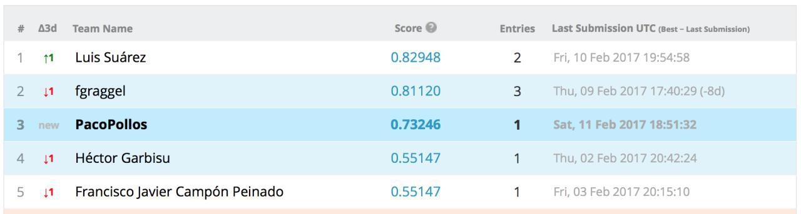

```{r setup, include=FALSE}
knitr::opts_chunk$set(echo = TRUE)
setwd("~/Dropbox/zMaster/zRStudio/Master-en-Ciencia-De-Datos-e-Ingeniería-de-Computadores/2 Mineria de datos, preprocesamiento y clasificacion")
library(party)
```

# 1 Introducción al problema y a Kaggel
Lo primero que se pretende realizar en este apartado es leer el dataset que nos han dado y realizar una subida a la plataforma Kaggel para obtener una primera puntuación.

## 1.1 Lectura del dataset accidentes
Vamos a leer tanto los archivos de train como test dados.
```{r }
accidentes.train.original <- read.csv("accidentes-kaggle.csv")
accidentes.test.original <- read.csv("accidentes-kaggle-test.csv")
```
Una vez leídos vamos a realizar un summary para ver como están compuestos los datos.
```{r }
summary(accidentes.train.original)
```
Vemos como las variables TTO_VICTIMAS, TOT_MUERTOS, TOT_HERIDOS_GRAVES, TOT_HERIDOS_LEVES y TOT_VEHICULOS_IMPLICADOS son las únicas variables numéricas, por lo que nos quedaremos con ellas para la primera prueba, junto con la variable clasificadora TIPO_ACCIDENTE.
```{r }
accidentes.train.solo.numericos <- accidentes.train.original[,c(8,9,10,11,12,30)]
accidentes.test.solo.numericos <- accidentes.test.original[,c(8,9,10,11,12)]
```

## 1.2 Primera prueba con un modelo
Lo primero es, con las variables numéricas únicamente, voy a realizar un primer modelo, que será un árbol, para predecir la clase del conjunto de test y comprobar el funcionamiento de Kaggel al no tener experiencia anterior.
```{r }
set.seed(1234)
ct <- ctree(TIPO_ACCIDENTE ~., accidentes.train.solo.numericos)
testPred <- predict(ct, newdata = accidentes.test.solo.numericos)
```
Por lo que ya tenemos el conjunto de test predecido. Además el árbol creado tendría la siguiente estructura:
```{r }
ct
```

## 1.3 Creación del archivo de salida y subida a kaggel
Vamos a escribir la salida del primer modelo para ver su puntuación en Kaggel.
```{r }
daaa <- as.matrix(testPred)
write.table(daaa,file="predicciones/PrimeraPrediccion.txt",sep=",",quote = F)
```
Por lo que ya tenemos un fichero con la salida del conjunto de test. Lo único que tendremos que modificar es la primera linea del archivo para añadir "Id, Prediction".
El resultado de este primer modelo para la competición de Kaggel, subido el 11/02/2017 a las 19:54, con un total de 5 personas entregadas, se ha quedado en la posición 3 con una puntuación del 0.73246. 



