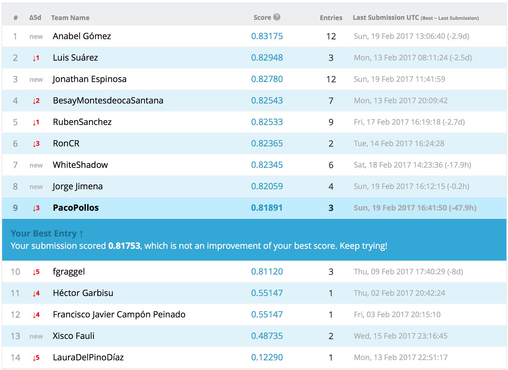

```{r setup, include=FALSE}
knitr::opts_chunk$set(echo = TRUE)
setwd("~/Dropbox/zMaster/zRStudio/Master-en-Ciencia-De-Datos-e-Ingeniería-de-Computadores/2 Mineria de datos, preprocesamiento y clasificacion")
library(party)
```

# Introducción al problema y a Kaggel
Lo primero que se pretende realizar en este apartado es leer el dataset que nos han dado y realizar una subida a la plataforma Kaggel para obtener una primera puntuación.
Mi usuario en Kaggel es "PacoPollos".

## Lectura del dataset accidentes
Vamos a leer tanto los archivos de train como test dados.
```{r }
accidentes.train.original <- read.csv("accidentes-kaggle.csv")
accidentes.test.original <- read.csv("accidentes-kaggle-test.csv")
```
Una vez leídos vamos a realizar un summary para ver como están compuestos los datos.
```{r }
summary(accidentes.train.original)
```
Vemos como las variables TTO_VICTIMAS, TOT_MUERTOS, TOT_HERIDOS_GRAVES, TOT_HERIDOS_LEVES y TOT_VEHICULOS_IMPLICADOS son las únicas variables numéricas, por lo que nos quedaremos con ellas para la primera prueba, junto con la variable clasificadora TIPO_ACCIDENTE.
```{r }
accidentes.train.solo.numericos <- accidentes.train.original[,c(8,9,10,11,12,30)]
accidentes.test.solo.numericos <- accidentes.test.original[,c(8,9,10,11,12)]
```

## Primera prueba con un modelo
Lo primero es, con las variables numéricas únicamente, voy a realizar un primer modelo, que será un árbol, para predecir la clase del conjunto de test y comprobar el funcionamiento de Kaggel al no tener experiencia anterior.
```{r }
set.seed(1234)
ct1 <- ctree(TIPO_ACCIDENTE ~., accidentes.train.solo.numericos)
testPred1 <- predict(ct1, newdata = accidentes.test.solo.numericos)
```
Por lo que ya tenemos el conjunto de test predecido. Además el árbol creado tendría la siguiente estructura:
```{r }
ct1
```

## Creación del archivo de salida y subida a kaggel
Vamos a escribir la salida del primer modelo para ver su puntuación en Kaggel.
```{r }
salida.primer.modelo <- as.matrix(testPred1)
salida.primer.modelo <- cbind(c(1:(dim(salida.primer.modelo)[1])), salida.primer.modelo)
colnames(salida.primer.modelo) <- c("Id","Prediction")
write.table(salida.primer.modelo,file="predicciones/PrimeraPrediccion.txt",sep=",",quote = F,row.names = F)
```
Por lo que ya tenemos un fichero con la salida del conjunto de test. Lo único que tendremos que modificar es la primera linea del archivo para añadir "Id, Prediction".
El resultado de este primer modelo para la competición de Kaggel, subido el 11/02/2017 a las 19:54, con un total de 5 personas entregadas, se ha quedado en la posición 3 con una puntuación del 0.73246. 


# Análisis del dataset
Una vez realizada la primera prueba en Kaggel, vamos a analizar con detalle el dataset que nos han dado.

## Eliminación de valores perdidos

Anteriormente en el summary, hemos visto que hay variables con valores perdidos, ya que por ejemplo, en la variable CARRETERA uno de los valores que más se repite es NA's. Por lo tanto, vamos a analizar que variables contienen valores perdidos.
```{r}
porcentaje.de.valores.perdidos.por.columna.train <- apply(accidentes.train.original,2,function(x) sum(is.na(x))) / ncol(accidentes.train.original) * 100
columnas.train.con.valores.perdidios <- (porcentaje.de.valores.perdidos.por.columna.train > 0)
columnas.train.con.valores.perdidios
```
Por lo que tenemos que las variables con valores perdidos son: CARRETERA, ACOND_CALZADA, PRIORIDAD, VISIBILIDAD_RESTRINGIDA, OTRA_CIRCUNSTANCIA, ACERAS, DENSIDAD_CIRCULACION y MEDIDAS_ESPECIALES. 
Veamos el resumen para esas variables.
```{r}
summary(accidentes.train.original[c("CARRETERA","ACOND_CALZADA","PRIORIDAD", "VISIBILIDAD_RESTRINGIDA", "OTRA_CIRCUNSTANCIA", "ACERAS", "DENSIDAD_CIRCULACION", "MEDIDAS_ESPECIALES")])
```
Donde podemos ver que el valor más pequeño de NA's es para la variable ACERAS con 3149 instancias con valores perdidos, lo que sería un 10,49% de los datos. Un 25% de los datos de este train serían unas 7500 instancias, por lo que las variables que tienen más del 25% de valores perdidos son: CARRETERA, ACOND_CALZADA, PRIORIDAD, VISIBILIDAD_RESTRINGIDA, DENSIDAD_CIRCULACION y MEDIDAS_ESPECIALES. O lo que es lo mismo, me quedo con las variables OTRA_CIRCUNSTANCIA y ACERAS, del anterior grupo. Pero además voy a comenzar eliminando esas variables ya que a mi juicio pueden no tener demasiada importancia.
```{r}
primeras.variables.eliminadas <- c("CARRETERA","ACOND_CALZADA","PRIORIDAD", "VISIBILIDAD_RESTRINGIDA", "DENSIDAD_CIRCULACION", "MEDIDAS_ESPECIALES", "OTRA_CIRCUNSTANCIA", "ACERAS")
accidentes.train.sin.variables.1 <- accidentes.train.original[,-c(15,20,21,25,26,27,28,29)]
accidentes.train.variables.eliminadas <- accidentes.train.original[,c(15,20,21,25,26,27,28,29)]
```
Por lo que guardo en una variable las variables que he eliminado, y creo mi dataset sin variables con valores NA. Hago lo mismo para el test:
```{r}
accidentes.test.sin.variables.1 <- accidentes.test.original[,-c(15,20,21,25,26,27,28,29)]
accidentes.test.variables.eliminadas <- accidentes.test.original[,c(15,20,21,25,26,27,28,29)]
accidentes.test.variables.eliminadas.copia <- accidentes.test.variables.eliminadas
```

Pensemos ahora que variables restantes pueden ser no interesantes.
```{r}
summary(accidentes.train.sin.variables.1)
```
Podemos pensar que otras de las variables que puede que no nos sean de mucha utilidad pueden ser: ANIO, MES, HORA, DIASEMANA, PROVINCIA, COMUNIDAD_AUTONOMA, ISLA, ZONA_AGRUPADA, TIPO_VIA, TRAZADO_NO_INTERSEC, TIPO_INTERSEC, SUPERFICIE_CALZADA y LUMINOSIDAD. Ya que muchas de estas variables podrían no ser de vital importancia, de primera mano, para la obtención de la predicción del tipo de accidente. Por lo tanto, vamos a eliminarlas de momento para agilizar los modelos primeros.
```{r}
segundas.variables.eliminadas <- c("ANIO", "MES", "HORA", "DIASEMANA", "PROVINCIA", "COMUNIDAD_AUTONOMA", "ISLA", "ZONA_AGRUPADA", "TIPO_VIA", "TRAZADO_NO_INTERSEC", "TIPO_INTERSEC", "SUPERFICIE_CALZADA", "LUMINOSIDAD")
accidentes.train.sin.variables.2 <- accidentes.train.sin.variables.1[,-c(1,2,3,4,5,6,7,14,16,17,18,19,20)]
accidentes.train.variables.eliminadasa <- cbind(accidentes.train.variables.eliminadas ,accidentes.train.sin.variables.1[,c(1,2,3,4,5,6,7,14,16,17,18,19,20)])
accidentes.test.sin.variables.2 <- accidentes.test.sin.variables.1[,-c(1,2,3,4,5,6,7,14,16,17,18,19,20)]
accidentes.test.variables.eliminadas <- cbind(accidentes.test.sin.variables.2 ,accidentes.test.original[,c(1,2,3,4,5,6,7,14,16,17,18,19,20)])
```
Donde podemos ver ahora el resumen del dataset resultante:
```{r}
summary(accidentes.train.sin.variables.2)
```

## Prueba del modelo con eliminación de variables
Hagamos por lo tanto una prueba de como afecta la inclusión de estas variables con respecto a la primera prueba realizada.
```{r }
set.seed(1234)
ct2 <- ctree(TIPO_ACCIDENTE ~., accidentes.train.sin.variables.2)
testPred2 <- predict(ct2, newdata = accidentes.test.sin.variables.2)
```
Por lo que ya tenemos el conjunto de test predecido. Además el árbol creado tendría la siguiente estructura:
```{r }
#ct2
```
Vamos a escribir la salida del modelo para ver su puntuación en Kaggel.
```{r }
salida.segundo.modelo <- as.matrix(testPred2)
salida.segundo.modelo <- cbind(c(1:(dim(salida.segundo.modelo)[1])), salida.segundo.modelo)
colnames(salida.segundo.modelo) <- c("Id","Prediction")
write.table(salida.segundo.modelo,file="predicciones/SegundaPrediccion.txt",sep=",",quote = F,row.names = F)
```
El resultado de este modelo para la competición de Kaggel, subido el 17/02/2017 a las 17:51, con un total de 14 personas entregadas, se ha quedado en la posición 9 con una puntuación del 0.81891. 


# Vusualización del dataset
Como no se ha hecho antes, y debería ser uno de los primeros pasos a realizar, vamos a realizar una visualización del dataset. 

## Análisis de las variables actuales
Vamos a ver el comportamiento de nuestras variables con respecto al TIPO_ACCIDENTE, a ver que relación pueden tener.
```{r}
library(ggplot2)
ggplot(data = accidentes.train.sin.variables.2) + geom_point(mapping = aes(x = TOT_VICTIMAS , y = TIPO_ACCIDENTE))
```
Podemos ver como para a partir de 10 victimas, el accidente suele ser o una colisión de vehículos, salida de vía, o muy pocas veces otro tipo de accidente. Por lo que puede ser una relación interesante. 
```{r}
ggplot(data = accidentes.train.sin.variables.2) + geom_point(mapping = aes(x = TOT_MUERTOS , y = TIPO_ACCIDENTE))
ggplot(data = accidentes.train.sin.variables.2) + geom_point(mapping = aes(x = TOT_HERIDOS_GRAVES , y = TIPO_ACCIDENTE))
ggplot(data = accidentes.train.sin.variables.2) + geom_point(mapping = aes(x = TOT_HERIDOS_LEVES , y = TIPO_ACCIDENTE))
ggplot(data = accidentes.train.sin.variables.2) + geom_point(mapping = aes(x = TOT_VEHICULOS_IMPLICADOS , y = TIPO_ACCIDENTE))
```
Normalmente a partir de 3 muertos, el accidente es una colisión de vehículos o una salida de via. Si hay más de 3 heridos graves, suele ser colisión de vehículos, salida de via o vuelco. A partir de 6 heridos leves el accidente es una colisión, una salida de via, un vuelco o otro accidente. A partir de 6 vehículos implicados, los accidentes suelen ser colisiones, salida de via u otro tipo. 
Por lo que ya tenemos varias relaciones que podrían ser representadas en un arbol. 

```{r}
ggplot(data = accidentes.train.sin.variables.1) + geom_bar(mapping = aes(x=TIPO_ACCIDENTE, fill=ZONA))
```
Podemos ver como las zonas predominantes son carretera y zona urbana, pero no parece que esta variable pueda ser influyente a la hora de decir que tipo de accidente se produce por lo que eliminaré esta variable para futuras pruebas.
```{r}
ggplot(data = accidentes.train.sin.variables.1) + geom_bar(mapping = aes(x=TIPO_ACCIDENTE, fill=RED_CARRETERA))
```
Puede parecer que esta variable no tiene demasiado que ver con la variable que queremos predecir por lo que puede ser que la descartemos.
```{r}
ggplot(data = accidentes.train.sin.variables.1) + geom_bar(mapping = aes(x=TIPO_ACCIDENTE, fill=FACTORES_ATMOSFERICOS))
```
Por el conocimiento que tenemos, seguramente esta variable no sea demasiado importante para el tipo de accidente. Veamos que le ocurre si eliminamos los elementos que tienen buen tiempo.
```{r}
vector.buen.tiempo <- accidentes.train.sin.variables.1$FACTORES_ATMOSFERICOS == "BUEN TIEMPO"
valores.sin.buen.tiempo <- accidentes.train.sin.variables.1[!vector.buen.tiempo,]
ggplot(data = valores.sin.buen.tiempo) + geom_bar(mapping = aes(x=TIPO_ACCIDENTE, fill=FACTORES_ATMOSFERICOS))
```
Pero seguimos viendo que no se puede sacar ninguna conclusión de esta visualización. 

## Análisis de variables eliminadas sin valores perdidos
Recordemos las variables que eliminamos sin tener valores perdidios.
```{r}
segundas.variables.eliminadas
```
Una de la variables que podrían ser interesantes es TIPO_VIA, TRAZADO_NO_INTERSEC, TIPO_INTERSEC, SUPERFICIE_CALZADA y LUMINOSIDAD. Veamos visualizaciones de estas variables.
```{r}
ggplot(data = accidentes.train.sin.variables.1) + geom_bar(mapping = aes(x=TIPO_ACCIDENTE, fill=TIPO_VIA))
```
Eliminemos las instancias con OTRO TIPO o VIA CONVENCIONAL
```{r}
vector.sin.otrotipo.y.viaconvencional <- ((accidentes.train.sin.variables.1$TIPO_VIA == "OTRO TIPO") | (accidentes.train.sin.variables.1$TIPO_VIA == "VIA CONVENCIONAL") )
valores.sin.otrotipo.y.viaconvencional <- accidentes.train.sin.variables.1[!vector.sin.otrotipo.y.viaconvencional,]
ggplot(data = valores.sin.otrotipo.y.viaconvencional) + geom_bar(mapping = aes(x=TIPO_ACCIDENTE, fill=TIPO_VIA))
```
No se observa que sea una variable demasiada importante.
```{r}
ggplot(data = accidentes.train.sin.variables.1) + geom_bar(mapping = aes(x=TIPO_ACCIDENTE, fill=TRAZADO_NO_INTERSEC))
ggplot(data = accidentes.train.sin.variables.1) + geom_bar(mapping = aes(x=TIPO_ACCIDENTE, fill=TIPO_INTERSEC))
ggplot(data = accidentes.train.sin.variables.1) + geom_bar(mapping = aes(x=TIPO_ACCIDENTE, fill=SUPERFICIE_CALZADA))
ggplot(data = accidentes.train.sin.variables.1) + geom_bar(mapping = aes(x=TIPO_ACCIDENTE, fill=LUMINOSIDAD))
```
Por lo que no podemos sacar demasiada información así que no añadiremos ninguna a las que ya estamos usando de momento.

# Visión preeliminar de los datos
Como anteriormente ya hicimos el summary, no será necesario volver a hacerlo. Lo que si vamos a hacer es un str, para obtener la información de las variables.
```{r}
str(accidentes.train.sin.variables.1)
```
Si queremos información más detallada:
```{r}
library(Hmisc)
describe(accidentes.train.sin.variables.2[1])
```
Esto lo podemos hacer con las variables que veamos oportunas. 
Otra forma de ver más información es:
```{r}
library(fBasics)
basicStats(accidentes.train.sin.variables.2[1])
```

# Imputación de valores perdidos
Vamos a usar uso del paquete mice para imputar los datos.

## Imputación de variables
Veamos que variables teniamos con valores perdidos.
```{r}
summary(accidentes.train.variables.eliminadas)
```
Vemos que dos de estas variables que podrían ser más interesantes son visibilidad restringida y prioridad, por lo que vamos a proceder a imputar sus valores perdidos.
```{r}
accidentes.train.a.imputar <- cbind(accidentes.train.sin.variables.2, accidentes.train.variables.eliminadas[,3:4])
accidentes.test.a.imputar <- cbind(accidentes.test.sin.variables.2, accidentes.test.variables.eliminadas.copia[,3:4])
library(mice)
set.seed(1234)
train.imputados.incompletos <- mice::mice(accidentes.train.a.imputar, m=1, method="pmm")
train.imputados <- mice::complete(train.imputados.incompletos)
test.imputados.incompletos <- mice::mice(accidentes.test.a.imputar, m=5, method="pmm")
test.imputados <- mice::complete(test.imputados.incompletos)
```

## Prueba del modelo con imputación de valores perdidos
Hagamos por lo tanto una prueba de como afecta la imputación de valores perdidos.
```{r }
set.seed(1234)
ct3 <- ctree(TIPO_ACCIDENTE ~., train.imputados)
testPred3 <- predict(ct3, newdata = test.imputados)
```
Por lo que ya tenemos el conjunto de test predecido. Además el árbol creado tendría la siguiente estructura:
```{r }
#ct3
```
Vamos a escribir la salida del modelo para ver su puntuación en Kaggel.
```{r }
salida.tercer.modelo <- as.matrix(testPred3)
salida.tercer.modelo <- cbind(c(1:(dim(salida.tercer.modelo)[1])), salida.tercer.modelo)
colnames(salida.tercer.modelo) <- c("Id","Prediction")
write.table(salida.tercer.modelo,file="predicciones/TerceraPrediccion.txt",sep=",",quote = F,row.names = F)
```
El resultado de este modelo para la competición de Kaggel, subido el 19/02/2017 a las 17:42, con un total de 14 personas entregadas, se ha quedado en la posición 9 con una puntuación del 0.81753. Bajando muy poco con respecto a la anterior puntuación.  




