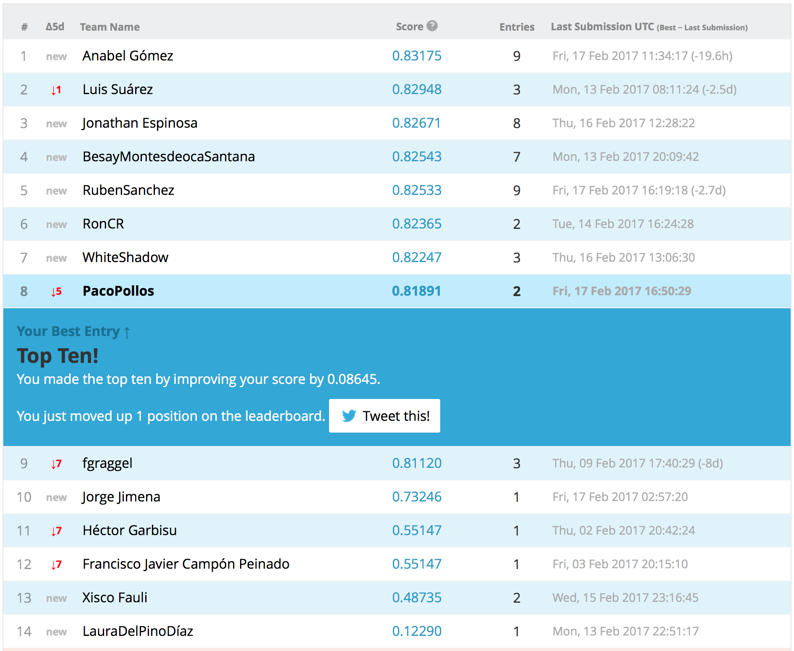

```{r setup, include=FALSE}
knitr::opts_chunk$set(echo = TRUE)
setwd("~/Dropbox/zMaster/zRStudio/Master-en-Ciencia-De-Datos-e-Ingeniería-de-Computadores/2 Mineria de datos, preprocesamiento y clasificacion")
library(party)
```

# Introducción al problema y a Kaggel
Lo primero que se pretende realizar en este apartado es leer el dataset que nos han dado y realizar una subida a la plataforma Kaggel para obtener una primera puntuación.
Mi usuario en Kaggel es "PacoPollos".

## Lectura del dataset accidentes
Vamos a leer tanto los archivos de train como test dados.
```{r }
accidentes.train.original <- read.csv("accidentes-kaggle.csv")
accidentes.test.original <- read.csv("accidentes-kaggle-test.csv")
```
Una vez leídos vamos a realizar un summary para ver como están compuestos los datos.
```{r }
summary(accidentes.train.original)
```
Vemos como las variables TTO_VICTIMAS, TOT_MUERTOS, TOT_HERIDOS_GRAVES, TOT_HERIDOS_LEVES y TOT_VEHICULOS_IMPLICADOS son las únicas variables numéricas, por lo que nos quedaremos con ellas para la primera prueba, junto con la variable clasificadora TIPO_ACCIDENTE.
```{r }
accidentes.train.solo.numericos <- accidentes.train.original[,c(8,9,10,11,12,30)]
accidentes.test.solo.numericos <- accidentes.test.original[,c(8,9,10,11,12)]
```

## Primera prueba con un modelo
Lo primero es, con las variables numéricas únicamente, voy a realizar un primer modelo, que será un árbol, para predecir la clase del conjunto de test y comprobar el funcionamiento de Kaggel al no tener experiencia anterior.
```{r }
set.seed(1234)
ct1 <- ctree(TIPO_ACCIDENTE ~., accidentes.train.solo.numericos)
testPred1 <- predict(ct1, newdata = accidentes.test.solo.numericos)
```
Por lo que ya tenemos el conjunto de test predecido. Además el árbol creado tendría la siguiente estructura:
```{r }
ct1
```

## Creación del archivo de salida y subida a kaggel
Vamos a escribir la salida del primer modelo para ver su puntuación en Kaggel.
```{r }
salida.primer.modelo <- as.matrix(testPred1)
write.table(salida.primer.modelo,file="predicciones/PrimeraPrediccion.txt",sep=",",quote = F)
```
Por lo que ya tenemos un fichero con la salida del conjunto de test. Lo único que tendremos que modificar es la primera linea del archivo para añadir "Id, Prediction".
El resultado de este primer modelo para la competición de Kaggel, subido el 11/02/2017 a las 19:54, con un total de 5 personas entregadas, se ha quedado en la posición 3 con una puntuación del 0.73246. 


# Análisis del dataset
Una vez realizada la primera prueba en Kaggel, vamos a analizar con detalle el dataset que nos han dado.

## Eliminación de valores perdidos

Anteriormente en el summary, hemos visto que hay variables con valores perdidios, ya que por ejemplo, en la variable CARRETERA uno de los valores que más se repite es NA's. Por lo tanto, vamos a analizar que variables contienen valores perdidos.
```{r}
porcentaje.de.valores.perdidos.por.columna.train <- apply(accidentes.train.original,2,function(x) sum(is.na(x))) / ncol(accidentes.train.original) * 100
columnas.train.con.valores.perdidios <- (porcentaje.de.valores.perdidos.por.columna.train > 0)
columnas.train.con.valores.perdidios
```
Por lo que tenemos que las variables con valores perdidos son: CARRETERA, ACOND_CALZADA, PRIORIDAD, VISIBILIDAD_RESTRINGIDA, OTRA_CIRCUNSTANCIA, ACERAS, DENSIDAD_CIRCULACION y MEDIDAS_ESPECIALES. 
Veamos el resumen para esas variables.
```{r}
summary(accidentes.train.original[c("CARRETERA","ACOND_CALZADA","PRIORIDAD", "VISIBILIDAD_RESTRINGIDA", "OTRA_CIRCUNSTANCIA", "ACERAS", "DENSIDAD_CIRCULACION", "MEDIDAS_ESPECIALES")])
```
Donde podemos ver que el valor más pequeño de NA's es para la variable ACERAS con 3149 instancias con valores perdidos, lo que sería un 10,49% de los datos. Un 25% de los datos de este train serían unas 7500 instancias, por lo que las variables que tienen más del 25% de valores perdidios son: CARRETERA, ACOND_CALZADA, PRIORIDAD, VISIBILIDAD_RESTRINGIDA, DENSIDAD_CIRCULACION y MEDIDAS_ESPECIALES. O lo que es lo mismo, me quedo con las variables OTRA_CIRCUNSTANCIA y ACERAS, del anterior grupo. Pero además voy a comenzar eliminando esas variables ya que a mi juicio pueden no tener demasiada importancia.
```{r}
primeras.variables.eliminadas <- c("CARRETERA","ACOND_CALZADA","PRIORIDAD", "VISIBILIDAD_RESTRINGIDA", "DENSIDAD_CIRCULACION", "MEDIDAS_ESPECIALES", "OTRA_CIRCUNSTANCIA", "ACERAS")
accidentes.train.sin.variables.1 <- accidentes.train.original[,-c(15,20,21,25,26,27,28,29)]
accidentes.train.variables.eliminadas <- accidentes.train.original[,c(15,20,21,25,26,27,28,29)]
```
Por lo que guardo en una variable las variables que he eliminado, y creo mi dataset sin variables con valores NA. Hago lo mismo para el test:
```{r}
accidentes.test.sin.variables.1 <- accidentes.test.original[,-c(15,20,21,25,26,27,28,29)]
accidentes.test.variables.eliminadas <- accidentes.test.original[,c(15,20,21,25,26,27,28,29)]
```

Pensemos ahora que variables restantes pueden ser no interesantes.
```{r}
summary(accidentes.train.sin.variables.1)
```
Podemos pensar que otras de las variables que puede que no nos sean de mucha utilidad pueden ser: ANIO, MES, HORA, DIASEMANA, PROVINCIA, COMUNIDAD_AUTONOMA, ISLA, ZONA_AGRUPADA, TIPO_VIA, TRAZADO_NO_INTERSEC, TIPO_INTERSEC, SUPERFICIE_CALZADA y LUMINOSIDAD. Ya que muchas de estas variables podrían no ser de vital importancia, de primera mano, para la obtención de la predicción del tipo de accidente. Por lo tanto, vamos a eliminarlas de momento para agilizar los modelos primeros.
```{r}
segundas.variables.eliminadas <- c("ANIO", "MES", "HORA", "DIASEMANA", "PROVINCIA", "COMUNIDAD_AUTONOMA", "ISLA", "ZONA_AGRUPADA", "TIPO_VIA", "TRAZADO_NO_INTERSEC", "TIPO_INTERSEC", "SUPERFICIE_CALZADA", "LUMINOSIDAD")
accidentes.train.sin.variables.2 <- accidentes.train.sin.variables.1[,-c(1,2,3,4,5,6,7,14,16,17,18,19,20)]
accidentes.train.variables.eliminadasa <- cbind(accidentes.train.variables.eliminadas ,accidentes.train.sin.variables.1[,c(1,2,3,4,5,6,7,14,16,17,18,19,20)])
accidentes.test.sin.variables.2 <- accidentes.test.sin.variables.1[,-c(1,2,3,4,5,6,7,14,16,17,18,19,20)]
accidentes.test.variables.eliminadas <- cbind(accidentes.test.sin.variables.2 ,accidentes.test.original[,c(1,2,3,4,5,6,7,14,16,17,18,19,20)])
```
Donde podemos ver ahora el resumen del dataset resultante:
```{r}
summary(accidentes.train.sin.variables.2)
```

## Prueba del modelo con eliminación de variables
Hagamos por lo tanto una prueba de como afecta la inclusión de estas variables con respecto a la primera prueba realziada.
```{r }
set.seed(1234)
ct2 <- ctree(TIPO_ACCIDENTE ~., accidentes.train.sin.variables.2)
testPred2 <- predict(ct2, newdata = accidentes.test.sin.variables.2)
```
Por lo que ya tenemos el conjunto de test predecido. Además el árbol creado tendría la siguiente estructura:
```{r }
ct2
```
Vamos a escribir la salida del modelo para ver su puntuación en Kaggel.
```{r }
salida.segundo.modelo <- as.matrix(testPred2)
write.table(salida.segundo.modelo,file="predicciones/SegundaPrediccion.txt",sep=",",quote = F)
```
El resultado de este primer modelo para la competición de Kaggel, subido el 17/02/2017 a las 17:51, con un total de 14 personas entregadas, se ha quedado en la posición 9 con una puntuación del 0.81891. 




